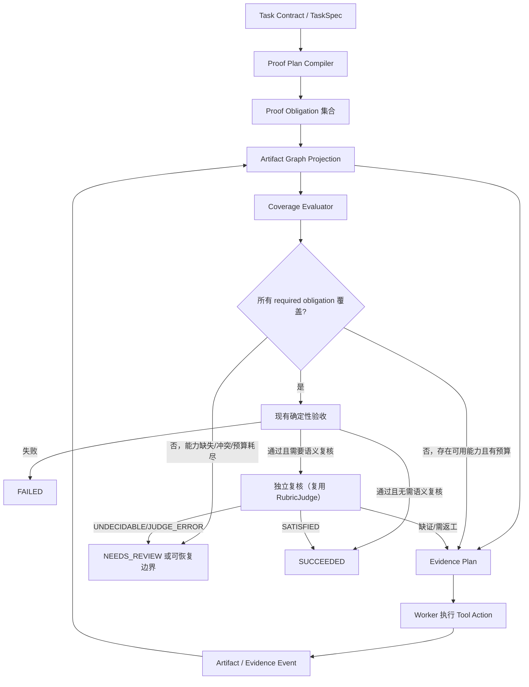

# Artifact Graph 与 Proof Obligation 任务证明闭环实施 SPEC

> 状态：**设计定稿**（R2 修订 + §12.6 待决项全部落定）。P0（与 P1 的只读归属）可开工；
> P2 强制仍受 §8 P1.5 门槛约束，不因待决项落定而提前。R1/R2 修订记录见 §12。
> 目标：把“任务计划、执行、取证、最终验证、可选独立复核、终态落定”统一为可回放的证明闭环。
> 前置约束：不按目录名、框架名、自然语言否定词或具体工具名称推断任务是否完成。

### R2 修订摘要（相对 R1，来自第二轮评审）

| 编号 | 修订 | 解决的缺陷 | 位置 |
|---|---|---|---|
| R2-1 | **P0 编译器只消费结构化字段**；散文类判据降级为 advisory 或 `SEMANTIC_REVIEW`。`ProofTemplate` 降为 P3+ 可选，不作为前置 | `TaskAcceptanceCriterion` 只有 4 个字段、**没有路径/selector/scope**，R1 的"有明确路径时"无法实现，只能去解析散文 = 违反本 SPEC 自己的禁令 | §2.3 AG-15 / §5.1 |
| R2-2 | obligation 编号指纹加入**规范化要求内容摘要**，并要求 selector **去版本化**（用 locator，不用 hash/artifact_id） | R1 指纹不含要求内容 → 要求变了编号不变、旧证据错误覆盖新要求；且 selector 带版本会让**每改一次文件编号就变**，清单爆炸、证据攒不起来 | §2.3 AG-10 / §4.2 |
| R2-3 | 不可关闭的 required 要求改为 **`UNFULFILLABLE_REQUIRED → NEEDS_REVIEW`**，取消"静默降级" | 静默降级 = 把用户明确的要求悄悄变成"可选项" → 可能报成功而没做（假成功）。**并注明它牵连既有 INV-3 降级逻辑，需独立回归** | §2.3 AG-9 / §4.5 |
| R2-4 | 绑定改为三段式 **Observation（观测）→ Sufficiency（充分性）→ Coverage（覆盖）**，取代"唯一匹配才绑定" | "唯一匹配"混淆了两个问题（可能影响哪些义务 / 是否足以关闭），并且**一次观测只能绑一条**会造成大量假 MISSING | §2.3 AG-14 / §4.6 |
| R2-4b | 新增护栏：**窄证据不得关闭宽义务**（充分性必须按声明 Scope + 版本判定） | 归属放宽后，若充分性过松会引入**假成功**——这是 R2-4 的新风险，必须配补偿控制与测试 | §4.6 / §9 |
| R2-5 | **终态映射单一化**：CLI / SDK / Web / Local API 共用同一个 verdict→state 映射函数 | **现存 bug**：`cli.py` 把任何未通过的验收映射为 `FAILED`，而 `sdk/runtime.py` 已把 `BLOCKED` 映射为 `NEEDS_REVIEW` → **同一结论、两种终态** | §2.3 AG-16 / §6.3 |
| R2-6 | `verify_task_acceptance()` 三段拆分（确定性 / 最终完整性 / 语义 Judge）**移到 P2 前置**，不是 P0 前置；P0 只需一条"只跑确定性部分"的只读路径 | 顺序过度约束：P0 是只读观测、不碰该函数；但 P0 诊断不应白调一次 judge | §8 P0 / P2 |

### R1 修订摘要（相对初稿）

| 编号 | 修订 | 位置 |
|---|---|---|
| R1-1 | 新增 **AG-9**：Runtime 无法用任何已注册能力关闭的要求不得编译为 required obligation（INV-3 的对应物） | §2.3 |
| R1-2 | 新增 **AG-10**：obligation 身份确定性派生 + 数量上界 | §2.3 / §4.2 |
| R1-3 | 新增 **AG-11**：Coverage Gap 必须作为既有 `CompletionReadiness` 的 required gap 生产，不得另起就绪通道 | §2.3 / §6.1 |
| R1-4 | 新增 **AG-12**：`FAILED` 只表示确定性反证；"缺失/未发生"在覆盖层是 `MISSING`。与既有 `REQUIRED_EFFECT` 判据的边界写明 | §2.3 / §6.2 |
| R1-5 | 新增 **AG-13**：`QUERY_CARDINALITY` 的零结果只在 Scope 根已观测且枚举完整时成立 | §2.3 / §5.3 |
| R1-6 | 新增 §4.5：`CoverageGap → CompletionGap` 映射与 `recoverable` 规则（决定 P2 会不会误拦截） | §4.5 |
| R1-7 | 新增 §4.6：Evidence **确定性自动绑定**，显式 intent 仅用于歧义 | §4.6 |
| R1-8 | `EvidenceCapability` 改为**由既有 `effect` + `result_authority` 派生**，只把真正新增的能力做成显式字段 | §4.3 |
| R1-9 | `SEMANTIC_REVIEW` **复用既有 `RubricJudgePort` 家族**，不新增第二套 judge 端口 | §7 |
| R1-10 | 明确非文件 Artifact 的 `version` 语义与 `ArtifactEdge.version` | §4.1 |
| R1-11 | 编译器映射表**按 `TaskCriterionKind` 枚举**列全，并说明 Runtime 作者类 | §5.1 |
| R1-12 | 新增 **P1.5**（绑定 + 能力预检 + Gap 映射），作为 P2 强制的前置 | §8 |

> ⚠️ **以 R2 为准**：R1-1（AG-9 曾为"不可关闭不编译"）、R1-2（AG-10 指纹）、R1-6（§4.5 曾用"唯一匹配绑定"与编译期降级）、R1-7（§4.6 曾为"唯一匹配才绑定"）、R1-12（P1.5 内容）均已被 R2 修订。R1 表格仅作历史记录，实施请按 R2 与正文。

### 目录

1. 背景与问题 · 2. 范围、非目标与不变量 · 3. 现有能力与改造边界 · 4. 领域模型（4.1 Artifact Graph / 4.2 Proof Obligation / 4.3 Evidence Capability / 4.4 Proof Plan 与 Coverage / **4.5 Coverage Gap 到就绪 Gap** / **4.5.1 UNFULFILLABLE_REQUIRED** / **4.6 三段式 Observation→Sufficiency→Coverage**） · 5. 端到端流程 · 6. 最终验证与任务终态（**6.3 终态映射单一化**） · 7. 独立复核（复用 RubricJudgePort） · 8. 实施分期（**P1.5** / P2 前置拆分） · 9. 测试与验收矩阵 · 10. 风险与决策点 · 11. 评审前置清单 · **12. R1/R2 评审记录与待决项（§12.6 收尾落定 D1–D6）**

---

## 1. 背景与问题

当前 Runtime 已有 Task/Session、TaskSpec、Planner、工具执行账本、工作区变更账本、确定性验收、CompletionReadiness 和终态状态机。这些能力能够驱动任务执行，但“计划要求什么”和“执行结果是否足以证明它已经满足”之间没有统一的结构化连接。

因此会出现以下通用风险：

1. Worker 的一次发现、一次读取、一次工具成功，可能被局部状态当成问题已解决；
2. Worker 口头声称“已完成”或“找不到”，缺少可机械验证的合同覆盖关系；
3. 验收层只能看到局部 criterion 或工具执行状态，不能回答“所有 required 要求是否由当前版本 Artifact 的证据覆盖”；
4. Runtime 发现证据缺口后不能向 Planner 返回精确、最小的补证目标；
5. 可选模型审查若直接读取 Worker 文本，仍会继承同一个错误前提。

本方案不再新增“项目画像”或后台结构缓存。工作区结构只作为当前 Task 的 Artifact Graph 事实，必须由实际观察、读取、解析、执行或变更事件产生。

---

## 2. 范围、非目标与不变量

### 2.1 范围

本方案覆盖一个 Task 从计划到终态的完整路径：

```text
Task Contract
  → Proof Plan
  → Artifact Graph / Evidence Plan
  → Worker 执行与证据记录
  → Coverage Verification
  → 可选 Semantic Review
  → Task terminal state
```

### 2.2 非目标

1. 不实现 workspace 级后台项目画像、Session 胶囊、额外数据库或后台扫描器；
2. 不将 `web`、`frontend`、`ui`、任何框架、语言或文件后缀作为特殊完成判定条件；
3. 不根据“没有”“不存在”“未实现”等自然语言词汇改变审查强度；
4. 不用独立模型替代确定性验证，也不允许模型自由宣布 `SUCCEEDED`；
5. 不重写现有 Task、Session、Sandbox、Workspace Mutation、模型恢复或取消协议。

### 2.3 核心不变量

| 编号 | 不变量 |
|---|---|
| AG-1 | 完成由 Proof Obligation 覆盖挣得，不能由 Worker 文本、工具成功标志或 UI 状态声明。 |
| AG-2 | 每一条 required obligation 必须可追溯到 Task Contract 中的一条需求、验收 criterion 或 required outcome。 |
| AG-3 | Evidence 只在它声明的能力、Scope、Artifact 版本与关系均匹配时，才能覆盖 obligation。 |
| AG-4 | Artifact 被写入、删除或版本变化后，依赖旧版本的 Evidence 必须标为 stale，不可继续覆盖。 |
| AG-5 | 未绑定 obligation 的发现型操作可以扩展 Artifact Graph，但不能关闭 required obligation。 |
| AG-6 | `SUCCEEDED` 必须蕴含所有 required obligation 均为 `COVERED`，且现有确定性验收通过。 |
| AG-7 | Runtime 资源耗尽、能力缺失、证据冲突或 Scope 不完整时，必须进入 `NEEDS_REVIEW` 或可恢复执行，不能伪造成功。 |
| AG-8 | 独立小模型只能复核已结构化的合同/义务/图/证据包；它不能读取 Worker 私有上下文、写工作区或直接改变终态。 |
| **AG-9** | **不可关闭的 required 要求不得静默降级。** 若一条 required 要求**能追溯到真实 Contract 要求**（criterion / outcome / required-effect）却在当前能力清单下无法关闭，必须进入 `UNFULFILLABLE_REQUIRED → NEEDS_REVIEW`（交人复核），**绝不**把它悄悄改成可选项——那等于把用户的要求丢掉并可能报成功。只有**编译器自己过度发挥造出来的**（无法追溯到 Contract）才允许不产生，且应由编译期修正而不是运行期降级。 |
| **AG-10** | **obligation 身份确定性且语义敏感**：`obligation_id` 由 `(contract_ref, predicate, **规范化要求内容摘要**, **去版本化 selector**)` 确定性派生。**必须包含要求内容摘要**（否则要求改了编号不变、旧证据错误覆盖新要求）；**selector 不得包含版本/hash/artifact_id**（否则每改一次文件编号就变，清单爆炸、证据无法累积）。TaskSpec 修订只允许新增或退役 obligation，不复用旧 id 表示不同要求；数量有界（见 §4.2）。 |
| **AG-11** | **Coverage Gap 就是就绪 Gap**：required coverage 缺口必须作为既有 `CompletionReadiness` 的 **required `CompletionGap`** 产出（INV-13 / INV-16）。不得新增第二套就绪事件，也不得绕过门直接进入验收或终态。 |
| **AG-12** | **`FAILED` 只表示确定性反证**（要求的命令验证失败、要求的副作用被明确证伪、工作区完整性不符）。"没有记录 / 未发生 / 未观测"在覆盖层是 `MISSING`，流向 `NEEDS_REVIEW`，**不得**被当作反证。唯一例外见 §6.2。 |
| **AG-13** | **零结果需要可辩护的 Scope**：`QUERY_CARDINALITY` 判定"应为 N 个"（含 N=0）时，Scope 根必须是**已观测的 Artifact**，枚举必须 `complete=true`，且 Scope 的扩大/收窄必须留下事件。否则一律 `BLOCKED`，不得据零结果宣布"不存在"。 |
| **AG-14** | **归属可以多、充分性必须严**：一次 Observation（观测）可以同时归属到**所有**能力/版本/Scope 兼容的 obligation（不要求"唯一匹配"），但是否 `COVERED` 必须由独立的 Sufficiency（充分性）判定给出。**窄证据不得关闭宽义务**：读取一个文件不能关闭"整个 Scope 都满足"的义务；枚举 `complete=false` 不能关闭任何要求完整性的义务（AG-3 / AG-13 的具体化）。 |
| **AG-15** | **编译器只消费结构化字段**：编译 Proof Plan 时只能读取 TaskSpec 的结构化字段（`verification_kind`、`evidence_reference` 前缀、outcome `kind`、`required_effects`、`atomic_action`）。**禁止解析 `description` 等自然语言**来决定 predicate 或 selector。散文类判据只能编译为 advisory，或（仅 `RUBRIC` / `GOAL_ALIGNMENT`）编译为 `SEMANTIC_REVIEW`。 |
| **AG-16** | **终态映射唯一**：verdict（判定结论）→ Task 终态的映射必须是**单一函数**，由 CLI / SDK / Web / Local API 共用。同一个判定结论在任何入口必须得到同一个终态；尤其 `BLOCKED` / 不可关闭 / 需复核类结论不得在某些入口被报成 `FAILED`。 |

---

## 3. 现有能力与改造边界

| 现有能力 | 保留与复用方式 | 新方案补齐内容 |
|---|---|---|
| `TaskSnapshot` / `SessionSnapshot` | 保留生命周期、状态机与持久化格式。 | 新增可回放的 proof projection，不新增 workspace 级状态。 |
| `TaskSpecSnapshot` / `TaskSpecPlanner` | 保留 Planner 对目标、Outcome、criterion 的规划。 | 将 TaskSpec 编译成 Proof Plan；Planner 不再直接决定完成。 |
| `ToolSpec` / `ToolExecutionRecord` | 保留参数、风险、效果（`effect`）、结果权威（`result_authority`）、执行账本。 | `EvidenceCapability` **由既有 `effect` + `result_authority` 派生**（§4.3），只把 `ENUMERATE_SCOPE`、`OBSERVE_RELATION` 做成新的显式声明字段；执行结果产生结构化 Evidence。 |
| `EvidenceQuestionProjection` | 保留为 Worker 发起调查时的意图/问题生命周期。 | 不再单独承担“已证明完成”的职责；其结果进入 Artifact Graph。 |
| `WorkspaceBaseline` / mutation journal | 保留 hash、写入、回滚和提交证明。 | 写入结果更新 Artifact Node，并使旧证据失效。 |
| `verify_task_acceptance()` / Final Acceptance | 保留既有领域判据、执行判据和 fail-closed 语义。 | 作为最终 Gate 的必要输入，追加 Proof Coverage 检查；`FAILED` 语义按 AG-12 收敛（"缺失"归覆盖层，不归反证层）。 |
| **`RubricJudgePort` / `ModelRubricJudge` / `JUDGED_CRITERION_WITHOUT_JUDGE`** | 保留为唯一的判官通道，含"无裁判不得 PASS"的既有约束。 | **`SEMANTIC_REVIEW` 复用本通道**（§7），不新增第二套 reviewer 端口；`SEMANTIC_REVIEW` obligation 由 `RUBRIC` / `GOAL_ALIGNMENT` criterion 编译而来。 |
| `CompletionReadiness` / `EXHAUSTED` | 保留有界继续、可恢复挂起与 `NEEDS_REVIEW` 分流；保留"无纠正计数器、按能力+资源界定"的现行设计。 | Coverage 缺口按 §4.5 映射为 required `CompletionGap`；不再以关键词或进度文本作停滞判断。 |
| Web/CLI/SDK Projection | 保留读模型与状态展示。 | 仅展示义务覆盖摘要和证据缺口，不展示/推断框架类型。 |

---

## 4. 领域模型

### 4.1 Artifact Graph

Artifact Graph 是 Task 范围内、由持久事件重放得到的图，不是项目摘要。

```python
class ArtifactKind(StrEnum):
    FILE = "FILE"
    SYMBOL = "SYMBOL"
    CONFIGURATION = "CONFIGURATION"
    COMMAND = "COMMAND"
    PROCESS = "PROCESS"
    TEST = "TEST"
    EXTERNAL_RESOURCE = "EXTERNAL_RESOURCE"
    EFFECT = "EFFECT"

class ArtifactRelation(StrEnum):
    CONTAINS = "CONTAINS"
    DEFINES = "DEFINES"
    REFERENCES = "REFERENCES"
    INVOKES = "INVOKES"
    CONFIGURES = "CONFIGURES"
    PRODUCES = "PRODUCES"
    VERIFIES = "VERIFIES"

@dataclass(frozen=True, slots=True)
class ArtifactNode:
    artifact_id: str
    kind: ArtifactKind
    locator: str
    version: str
    attributes: Mapping[str, Any]
    source_event_refs: tuple[str, ...]

@dataclass(frozen=True, slots=True)
class ArtifactEdge:
    edge_id: str
    source_artifact_id: str
    relation: ArtifactRelation
    target_artifact_id: str
    version: str
    source_event_refs: tuple[str, ...]

@dataclass(frozen=True, slots=True)
class ArtifactRef:
    artifact_id: str
    version: str
    locator: str
```

约束：

- `locator` 是路径、符号标识、命令规范签名或外部资源标识；不从文本猜测类型；文件路径必须经既有 `WorkspacePathPort` 归一化后再入图；
- 图只记录有限结构化摘要、hash 和引用，不把完整敏感工具输出写入公共投影；
- 一个工具发现的候选节点可以进入图，但候选节点本身不等于完成证据。

**`version` 的逐 kind 语义（R1-10）** — stale 判定依赖它，因此必须逐 kind 定义，不能只有文件有版本：

| `ArtifactKind` | `version` 取值 | 变化即 stale 的原因 |
|---|---|---|
| `FILE` | `sha256(内容)` | 内容变更 |
| `CONFIGURATION` | `sha256(内容)` + 生效作用域 | 内容或作用域变更 |
| `SYMBOL` | `sha256(宿主文件内容) + 符号限定名 + 声明区间` | 宿主文件或声明位置变更 |
| `COMMAND` | `规范化 argv 签名`（可执行文件 basename + 参数模板，不含运行结果） | 命令定义变更；**运行结果不进入命令版本**，结果属于 Evidence |
| `PROCESS` | `(process_id, started_at)` | 进程被替换 |
| `TEST` | `命令签名 + 该次执行的 result hash` | 测试本身或被测版本变更 |
| `EXTERNAL_RESOURCE` | 响应 `sha256` 或服务端 `ETag`/版本号；无则 `unknown` | 远端内容变更 |
| `EFFECT` | `mutation_id` 或 `(path, before_hash→after_hash)` | 副作用被回滚或再次修改 |

`ArtifactEdge.version` = **边两端节点版本的合成**（`hash(source.version, relation, target.version)`）；任一端版本变化即使该边版本变化，依赖该边的 Evidence 随之 stale。关系只允许来自解析、执行或变更事件，不能仅来自模型文本。

`EXTERNAL_RESOURCE` 在无法取得稳定版本标识时，其 Evidence **不得**覆盖要求"当前版本"的 obligation（只能覆盖 `ARTIFACT_EXISTS` 这类不依赖版本谓词的义务），否则会把一次过期抓取当成当前事实。

### 4.2 Proof Obligation

Proof Obligation 是 Task Contract 必须被证明的一条原子要求。

```python
class ObligationPredicate(StrEnum):
    ARTIFACT_EXISTS = "ARTIFACT_EXISTS"
    ARTIFACT_CONTENT = "ARTIFACT_CONTENT"
    RELATION_EXISTS = "RELATION_EXISTS"
    EFFECT_OBSERVED = "EFFECT_OBSERVED"
    COMMAND_VERIFIED = "COMMAND_VERIFIED"
    QUERY_CARDINALITY = "QUERY_CARDINALITY"
    SEMANTIC_REVIEW = "SEMANTIC_REVIEW"

@dataclass(frozen=True, slots=True)
class ProofObligation:
    obligation_id: str
    contract_ref: str
    required: bool
    predicate: ObligationPredicate
    subject_selector: Mapping[str, Any]
    expected: Mapping[str, Any]
    scope: Mapping[str, Any]
    required_capabilities: frozenset[EvidenceCapability]
    depends_on: tuple[str, ...]
```

说明：

- `contract_ref` 指向 TaskSpec 的 Outcome、Acceptance Criterion 或 Runtime 生成的 required-effect 条目；
- `subject_selector` 用通用 selector 描述目标，如 Artifact id、路径、符号、命令或关系端点；
- `QUERY_CARDINALITY` 用于“在已声明 Scope 中满足结构化查询的对象数量应为 N”，包括零个结果的情况；它不依赖自然语言“否定结论”（其成立条件见 AG-13 / §5.3）；
- `SEMANTIC_REVIEW` 仅用于无法由确定性证据完全判断的合同条目，**只能由 `TaskCriterionKind.RUBRIC` / `TaskCriterionKind.GOAL_ALIGNMENT` 编译得到**，不能由 Planner 为普通事实添加（见 §5.1）；
- required obligation 不能被 Worker 删除、降级或用文本关闭。

**身份与数量（R1-2 / R2-2 / AG-10）**：

```python
obligation_id = "obg-" + sha256(canonical_json({
    "contract_ref": contract_ref,                       # 稳定来源（criterion_id / outcome_id）
    "predicate": predicate.value,
    # 要求内容摘要：让"要求变了"必然导致编号变化
    "requirement_digest": sha256(normalize_text(requirement_text)),
    # 去版本化 selector：只用路径/符号名/命令签名等稳定定位符
    "selector": version_free_selector,                  # 不含 hash / artifact_id / 版本
}))[:16]
```

三条硬性要求：

1. **必须含 `requirement_digest`**：否则判据描述从"不再显示提示文案"改成"必须显示提示文案"时编号不变，旧证据会错误地覆盖这条**已经变了**的新要求；
2. **`selector` 必须去版本化**：只用 `locator`（路径、符号限定名、命令签名、外部资源标识），**不得**包含内容 hash、`artifact_id`（它由内容派生）或任何版本字段。否则**每改一次文件，obligation 编号就变一次**，清单不断"换号"、证据永远攒不起来 → 系统性误拦截；
3. **`normalize_text` 必须确定性**（折叠空白、统一大小写策略、去掉不影响语义的标点变体），否则同一要求会得到不同编号。

推论（必须实现）：

- **确定性**：同一 `(contract_ref, predicate, requirement, version_free_selector)` 永远得到同一 id；
- **只增不换**：修订只允许新增 obligation，或把不再需要的标为 `retired`（保留事件）；不允许用旧 id 表示新要求；
- **版本变化不改 id**：Artifact 版本变化只让 Evidence 变 `STALE`（AG-4），**不影响 obligation 身份**；
- **数量上界**：`required obligation 数 ≤ MAX_PROOF_OBLIGATIONS`（建议 64），且 `每条 criterion/outcome 编译出的 obligation ≤ 4`。超界时按 §5.1 的确定性优先级截断，并记 `proof.plan_truncated`（不是静默丢弃）。这条界存在的理由与 `MAX_AUTHORED_ACCEPTANCE_CRITERIA = 28` 相同：投影与 checkpoint 都要有界。**注意它与 id 稳定性相互作用**：正因为 id 去版本化，截断边界才稳定，不会出现"清单抖动"。

### 4.3 Evidence Capability 与 Evidence Record

**能力由已有声明派生，而不是 Runtime 判断工具名字，也不是第三套并行分类（R1-8）。**

`ToolSpec` 已经声明了两个正交事实：`effect`（这个动作做什么）与 `result_authority`（它的结果能确立什么事实）。`EvidenceCapability` 的大部分取值就是这两者的组合，因此**不新增需要每个 adapter 手工维护的第二份清单**：

```python
class EvidenceCapability(StrEnum):
    # —— 由 (effect, result_authority) 派生 ——
    READ_ARTIFACT = "READ_ARTIFACT"            # OBSERVE   + WORKSPACE_FACT
    MUTATE_ARTIFACT = "MUTATE_ARTIFACT"        # MUTATE    + MUTATION_FACT
    OBSERVE_EFFECT = "OBSERVE_EFFECT"          # OBSERVE   + PROCESS_FACT
    EXECUTE_VERIFICATION = "EXECUTE_VERIFICATION"  # EXECUTE + PROCESS_FACT
    OBSERVE_RUNTIME = "OBSERVE_RUNTIME"        # OBSERVE   + RUNTIME_FACT
    OBSERVE_EXTERNAL = "OBSERVE_EXTERNAL"      # OBSERVE   + EXTERNAL_SERVICE
    # —— 无法由现有两字段派生，必须显式声明 ——
    ENUMERATE_SCOPE = "ENUMERATE_SCOPE"        # 能给出"完整枚举"语义（含 skipped/stop_reason）
    OBSERVE_RELATION = "OBSERVE_RELATION"      # 能给出符号/配置/引用关系（解析结果）
```

```python
def derive_capabilities(spec: ToolSpec) -> frozenset[EvidenceCapability]:
    """确定性派生；显式声明只用于补充，不能与之冲突。"""
```

- 派生表是**唯一权威**；`ToolSpec` 上只需新增 `extra_evidence_capabilities: frozenset[EvidenceCapability] = frozenset()`，用于 `ENUMERATE_SCOPE` / `OBSERVE_RELATION` 这两个真正新增的能力；
- 若 adapter 的显式声明与派生结果冲突 → 启动期报错（fail-closed），不允许两个清单各自为真；
- **不需要每个 adapter 立刻改动**：只声明 `effect` + `result_authority` 的既有工具自动获得派生能力，因此 P0 不产生 adapter 迁移成本。

```python
@dataclass(frozen=True, slots=True)
class EvidenceRecord:
    evidence_id: str
    obligation_ids: tuple[str, ...]
    capability: EvidenceCapability
    artifact_refs: tuple[ArtifactRef, ...]
    scope: Mapping[str, Any]
    coverage: Mapping[str, Any]
    observation: Mapping[str, Any]
    source_event_ref: str
```

`coverage` 的最小契约：

```python
{
  "complete": bool,
  "enumerated_count": int | None,
  "skipped_count": int | None,
  "stop_reason": str | None,
  "artifact_versions": {"artifact_id": "hash"}
}
```

无 `complete=true` 的枚举结果不能覆盖要求完整 Scope 的 `QUERY_CARDINALITY` obligation。读取单一文件可以覆盖该文件当前版本的内容义务，但不能据此证明其它 Scope 的状态。

### 4.4 Proof Plan 与 Coverage

```python
class CoverageStatus(StrEnum):
    COVERED = "COVERED"
    MISSING = "MISSING"
    STALE = "STALE"
    CONFLICTING = "CONFLICTING"
    BLOCKED = "BLOCKED"

class ProofEnforcementMode(StrEnum):
    OBSERVE = "OBSERVE"
    ENFORCE_NEW_TASKS = "ENFORCE_NEW_TASKS"
    ENFORCE_ALL = "ENFORCE_ALL"

@dataclass(frozen=True, slots=True)
class ObligationCoverage:
    obligation_id: str
    status: CoverageStatus
    evidence_ids: tuple[str, ...]
    missing_capabilities: frozenset[EvidenceCapability]
    reason_code: str

@dataclass(frozen=True, slots=True)
class ProofPlanSnapshot:
    task_id: str
    task_spec_revision: int
    obligations: tuple[ProofObligation, ...]
    plan_hash: str
```

Proof Plan、Artifact Graph、Evidence Record 与 Coverage 通过 Runtime Event 持久化，并可投影进 Agent checkpoint。历史 Task 没有 Proof Plan 时保持兼容：仅允许读取旧状态，不能把旧工具结果追溯升级为新证据。

`ProofEnforcementMode` 的配置入口与默认值（R1-11 关联）：由既有配置装配读取，生产默认 `OBSERVE`；`ENFORCE_NEW_TASKS` 需显式开启；`ENFORCE_ALL` 另行评审（§8、§11）。模式变化必须写 `proof.enforcement_changed` 事件，便于事后区分"当时是否强制"。

### 4.5 Coverage Gap 到就绪 Gap 的映射（R1-6 / AG-11）

**这是决定 P2 会不会误拦截的关键节。** 覆盖层不自己决定"继续/挂起/复核"，它只生产**既有 `CompletionReadiness` 能消费的 `CompletionGap`**：

| `CoverageStatus` | `CompletionGap.kind` | `required` | `required_effects` | `candidate_tools` | `recoverable` |
|---|---|---|---|---|---|
| `MISSING` | `PROOF_COVERAGE_MISSING` | `true` | 由 obligation 的 `required_capabilities` 反查可提供该能力的工具效果集合 | 声明了目标能力的工具名（经 `WorkspacePathPort`/Scope 校验后） | **`bool(candidate_tools)`** |
| `STALE` | `PROOF_COVERAGE_STALE` | `true` | 同上（需要重新观测当前版本） | 同上 | **`bool(candidate_tools)`** |
| `CONFLICTING` | `PROOF_COVERAGE_CONFLICTING` | `true` | `()` | `()` | **`false`** |
| `BLOCKED` | `PROOF_COVERAGE_BLOCKED` | `true` | `()` | `()` | **`false`** |

规则：

1. **判定输入是 `required_effects`，不是 `recoverable` 布尔字段**（R2 澄清）。既有 `CompletionGap.effective_required_effects` 的语义是：`required_effects` 非空时**完全忽略** `recoverable` 字段；只有 `required_effects` 为空且 `recoverable=True` 时才回退成 `{OBSERVE}`。因此：
   - `MISSING` / `STALE`：填**所需能力对应的效果集合**（这就是判定输入），回退字段 `recoverable` 只作诊断展示；
   - `CONFLICTING` / `BLOCKED`：**必须**填 `required_effects=()` **且** `recoverable=False`，这样 `effective_required_effects` 为空 → 门的"可关闭"判据自然为假 → `EXHAUSTED`。
   **实现者容易犯的错**：以为"设 `recoverable=False` 就能拦住"——若 `required_effects` 非空则无效；反之若 `CONFLICTING` 忘了清空 `required_effects`，它会被误判成可关闭而反复重试。
2. **`recoverable` 对应的效果集合必须来自真实可用的工具**：`required_effects := { 工具.effect | 已注册工具提供所需 capability }`。恒 `true`（效果永远算作可用）⇒ 死循环重试；恒 `false` ⇒ 每个任务立刻 `NEEDS_REVIEW`。两者都是重演旧故障。
3. **`required=true` 恒成立**：`CompletionGap.required` 是 INV-13 的输入，覆盖缺口不得被降级为 advisory（降级就等于允许假成功）。
4. **`kind` 必须是新枚举值**：不得复用 `UNRESOLVED_EFFECT_FAILURE` 等既有 kind，否则无法在诊断与指标里区分"副作用失败"和"证明缺失"。
5. **INV-3 的降级豁免**：`PROOF_COVERAGE_*` 需加入 INV-3 的豁免集合（与既有 `_JUDGED_GAP_KINDS` 并列，命名建议 `_ESCALATED_GAP_KINDS`）——它们天然没有 `required_effects`（`CONFLICTING`/`BLOCKED`），若不豁免会被 INV-3 降级成可选，从而把"证据冲突"变成"可以完成"。
6. **不新增就绪事件**：Coverage 评估仍写 `completion.readiness_evaluated`（附带 `coverage_gap_ids`），`proof.coverage_evaluated` 只作为证明层的诊断事件，不参与状态迁移决策。

#### 4.5.1 不可关闭的 required 要求：`UNFULFILLABLE_REQUIRED`（R2-3 / AG-9）

**取消 R1 的"编译期静默降级"。** 编译器**不得**因为"当前没工具能做"就把一条能追溯到真实 Contract 的要求从 required 里去掉——那等于把用户的要求丢掉，而且可能让任务报 `SUCCEEDED`：

| 情形 | 编译期行为 | 运行期行为 |
|---|---|---|
| obligation 能追溯到真实 Contract 要求，但**当前无任何工具能关闭** | **照常标 `required`**，并记 `proof.obligation_unfulfillable{reason: NO_AVAILABLE_CAPABILITY}` | `CoverageEvaluator` 报 `BLOCKED` → §4.5 映射为 `PROOF_COVERAGE_BLOCKED` → `EXHAUSTED` → `NEEDS_REVIEW`（**不降级、不假成功、不死锁**） |
| obligation **无法追溯到任何 Contract 要求**（编译器过度发挥） | **不产生该 obligation**，记 `proof.obligation_rejected{reason: NO_CONTRACT_REF}` | 不存在 |
| obligation 可关闭但当前 Scope/预算不允许 | 照常 required | 正常的 `MISSING` → `CONTINUE` / `EXHAUSTED` |

为什么不是死锁：`EXHAUSTED` 是**有界**动作（一次 wrap-up 轮 → 可恢复挂起 → 连续无进展转 `NEEDS_REVIEW`），不是"永远等待"。

**连带影响（必须在实施时一起处理）**：现行代码里 INV-3 会对"没有有效效果且 kind 不在豁免集合"的 required gap **自动降级为可选**。本节的规则与它直接冲突：
- 对**能追溯到真实要求**的 gap（包含未来的 `UNFULFILLABLE_REQUIRED` / `PROOF_COVERAGE_*`）→ 必须加入豁免集合，**不允许**降级；
- 这一点同样适用于现行 `UNRESOLVED_EFFECT_FAILURE`（上一轮已加入豁免）；
- 因此 INV-3 的语义应收敛为"**只降级编译器/运行期自己造出来的、无 Contract 来源的 gap**"，并在实施 R2-3 时单独回归（它改动的是已上线行为）。

### 4.6 Evidence 绑定：三段式 Observation → Sufficiency → Coverage（R2-4 / R2-4b）

AG-5 要求"未绑定动作不得关闭 required obligation"。但"绑定"其实包含两个不同的问题，R1 把它们混成了一个（"唯一匹配才绑定"），后果是：一次观测只能绑一条义务 ⇒ 大量假 `MISSING` ⇒ 系统性误拦截。R2 拆成三段，**归属可以多、充分性必须严**（AG-14）：

```
① Observation（观测）     Tool Action 成功后产生的原始事实
                          （capability、artifact_refs、scope、coverage、source_event_ref）
        │  归属（attribution）：能力 + 版本 + Scope 兼容的全部 obligation
        ▼
② Evidence（证据）        观测 + 它所归属的 obligation 集合
                          一次观测可以同时归属给多条义务，不需要"唯一匹配"
        │  充分性（sufficiency）：按声明 Scope + 版本逐义务判定
        ▼
③ Coverage（覆盖）        每条 obligation 的 COVERED / MISSING / STALE / CONFLICTING / BLOCKED
```

**① → ② 归属规则**

| 情况 | 行为 |
|---|---|
| 归属到 **≥1** 条兼容义务 | 生成 Evidence，记录全部 `obligation_ids` 与 `binding_source`；**不因"不唯一"而失败** |
| 归属到 **0** 条 | 只扩展 Artifact Graph（AG-5），不产生 Evidence |
| 模型显式给出 `evidence_intent.obligation_ids` | 仍需通过 §5.2 的四项校验；校验通过则**加入**归属集合（不排除自动归属的结果） |

**② → ③ 充分性规则（R2-4b，防假成功）**

这是本节的**安全所在**——放宽归属之后，必须由充分性把关，否则"一次窄读取"会被算成"宽义务已覆盖"：

| obligation 要求 | 只有满足以下条件才 `COVERED` |
|---|---|
| `ARTIFACT_CONTENT`（某版本的内容） | Evidence 的 `artifact_refs` 含**该义务声明的 locator**，且版本 == 当前版本（否则 `STALE`） |
| `QUERY_CARDINALITY`（Scope 内计数 / "不存在"） | `coverage.complete == true` 且 Scope 根已观测且计数相符（AG-13 四条件） |
| `RELATION_EXISTS` | Evidence 的 capability 含 `OBSERVE_RELATION` 且关系来源可指回解析/执行事件 |
| `EFFECT_OBSERVED` | mutation journal / 执行账本中存在对应的成功记录，且当前 Artifact version 与之一致 |
| `COMMAND_VERIFIED` | 该命令在该版本上**成功**执行（非零退出即反证，不是"缺证"） |
| `SEMANTIC_REVIEW` | 判官肯定且逐义务引用 Evidence id（§7.2） |

**硬性护栏（必须写成测试）**：

> **窄证据不得关闭宽义务。** 读取一个文件**不能**关闭"整个 Scope 都满足"的义务；`complete=false` 的枚举**不能**关闭任何要求完整性的义务。归属放宽只影响"证据挂到哪几条义务上"，绝不改变"够不够"。

**补充约束**

- `binding_source ∈ {auto_attributed, explicit}` 记入 Evidence，便于诊断；
- 指标 `proof.auto_attribution_rate`（自动归属率）用于判断能否开 `ENFORCE_*`：若过低，说明**编译器的 locator/Scope 设计有问题，应先修编译器**，而不是要求模型手工填 id；
- 归属**不消耗模型回合**：正常路径下模型无需声明任何 intent；
- 若某义务长期只能靠显式 intent 归属（自动归属率对它为 0），应记为编译器缺陷信号（`proof.attribution_gap`），而不是继续要求模型配合。

---

## 5. 端到端流程



### 5.1 计划阶段：TaskSpec 编译为 Proof Plan

触发点：TaskSpec 首次生成、修订或 Outcome 绑定发生变化后。

`ProofPlanCompiler` 规则（**按 `TaskCriterionKind` 枚举列全**，R1-11；**且只消费结构化字段**，R2-1 / AG-15）。

**编译源白名单**（只能读这些字段）：`criterion.verification_kind`、`criterion.evidence_reference`（前缀 + 可解析出的引用）、`criterion.criterion_id`、outcome 的 `kind` / `required_effects` / `atomic_action` / `outcome_id`。
**禁止读取**：`criterion.description`、outcome 的 `description`、以及任何自然语言文本。因此 R1 里"有明确路径时"这类条件**必须删掉**——现有 `TaskAcceptanceCriterion` 只有 4 个字段（`criterion_id` / `description` / `verification_kind` / `evidence_reference`），**没有路径/selector/scope**，无从取得结构化路径。

| TaskSpec 来源（现有枚举） | 编译结果 | 依据的结构化字段 |
|---|---|---|
| `TaskCriterionKind.REQUIRED_EFFECT`（Runtime 作者，`required-effect-delivery`） | `EFFECT_OBSERVED` | outcome 的 `required_effects` |
| `TaskCriterionKind.WORKSPACE_INTEGRITY` | `EFFECT_OBSERVED`（对齐 mutation journal 与当前版本） | 仅 `verification_kind`。**不产出 `ARTIFACT_CONTENT`**：没有结构化路径可选 |
| `TaskCriterionKind.POST_MUTATION_COMMAND` | `COMMAND_VERIFIED` | `verification_kind`（+ 已有 mutation 记录） |
| `TaskCriterionKind.EVIDENCE_REFERENCE` | 由 `evidence_reference` 前缀确定性决定：`mutation:` → `EFFECT_OBSERVED`（路径由该 mutation 记录解析，**不用散文**）；`tool_call:` → 按该次执行的 capability 映射（`OBSERVE_EFFECT` / `READ_ARTIFACT` / `EXECUTE_VERIFICATION`）；`event:` → `ARTIFACT_EXISTS`（只断言"该事件存在"） | `evidence_reference` |
| `TaskCriterionKind.RUBRIC` | `SEMANTIC_REVIEW` | `verification_kind`（唯一合法的 `SEMANTIC_REVIEW` 来源之一） |
| `TaskCriterionKind.GOAL_ALIGNMENT`（Runtime 作者） | `SEMANTIC_REVIEW` | `verification_kind`（另一个合法来源） |
| Outcome `kind=WORKSPACE_DELIVERY` + `required_effects=[mutate]` | `EFFECT_OBSERVED` | `kind` + `required_effects`；与 `REQUIRED_EFFECT` 判据同源，去重后只产出一条 |
| Outcome `kind=COMMAND_RESULT` | `COMMAND_VERIFIED` | `kind` |
| Outcome `kind=ARTIFACT_DELIVERY` | `ARTIFACT_EXISTS`（若 `atomic_action.arguments` 含结构化路径则升级为 `ARTIFACT_CONTENT`） | `kind` + `atomic_action` |
| Outcome `kind=ANSWER` / `EVIDENCE` / `PROCESS_STATE` / `USER_DECISION` | `ANSWER` 只额外产出 `GOAL_ALIGNMENT` 对应的 `SEMANTIC_REVIEW`；`PROCESS_STATE` → `EFFECT_OBSERVED`（execute）；其余只产 advisory | `kind` / `required_effects`。**不得为 `ANSWER` 凭空造 `ARTIFACT_CONTENT`** |

**散文类判据怎么办（R2-1）**

| 判据形态 | 处置 |
|---|---|
| `verification_kind` 是 `RUBRIC` / `GOAL_ALIGNMENT` | 编译为 `SEMANTIC_REVIEW`（判官通道，§7） |
| 其余判据的**散文部分**（`description` 里比结构化字段多出来的要求） | 编译为 **advisory obligation**（`required=false`），只进诊断投影，**不参与 `can_succeed`**；并记 `proof.obligation_advisory{reason: PROSE_ONLY}` |
| 若某判据**完全无法**从结构化字段映射 | 不产生 obligation，记 `proof.obligation_rejected{reason: NOT_STRUCTURALLY_KNOWABLE}`；**不允许**为了"看起来完整"而猜 |

**`ProofTemplate` 的定位（R2-1）**：给 TaskSpec 增加结构化的 `proof_template`（selector / scope / predicate）是**更重**的方案——它把"选什么"交给 Planner，selector 写错就会变成永久 `MISSING`，而且与"编译器不得猜测"原则相抵触（等于把猜测前移给模型）。因此：
- **不作为 P0/P1/P2 的前置**；
- 如需引入（P3+ 可选），必须先证明"当前结构化编译源的 advisory 比例过高"，并且模板必须经过 schema 校验、selector 必须去版本化（§4.2）、失败时降级为 advisory 而非 required。

编译器约束：

- **确定性**：同一 TaskSpec（含 revision）必然编译出同一 obligation 集合与同一 id（AG-10）；
- **只读结构化字段**：见上方白名单；**禁止**解析 `description` 等自然语言（AG-15）；
- **拒绝而非猜测**：无法从结构化字段映射的判据 → advisory 或 `proof.obligation_rejected`，不得为了完整性而猜；
- **数量上界**：超出 `MAX_PROOF_OBLIGATIONS` 时按上表顺序（`REQUIRED_EFFECT` → `POST_MUTATION_COMMAND` → 其余）保留，并记 `proof.plan_truncated`（不静默丢弃）；
- **不可关闭**：能追溯到真实 Contract 要求但当前无工具可关闭者，**照常标 required** 并记 `proof.obligation_unfulfillable`，由运行期 `EXHAUSTED → NEEDS_REVIEW` 承接（§4.5.1 / AG-9）；**不得**在编译期静默降级；
- Planner 可以提出 TaskSpec，不直接创建任意形式的 proof。Runtime 作者类 criterion（`RUNTIME_AUTHORED_CRITERION_KINDS`）的 obligation 由 Runtime 派生，Planner 提交中即使携带也会被剥离。

### 5.2 执行阶段：观测自动归属，但充分性决定是否关闭义务

**默认路径是 Runtime 自动归属；显式 intent 只是可选补充（详细规则见 §4.6）。**

Worker 每个 Tool Action **可以**携带可选 `evidence_intent`：

```json
{
  "obligation_ids": ["obg-..."],
  "expected_capability": "READ_ARTIFACT",
  "target_selectors": [{"artifact_id": "..."}]
}
```

Runtime 校验（仅当 intent 出现时）：

1. `obligation_ids` 必须存在于当前 Proof Plan；
2. 工具声明的 `EvidenceCapability`（派生或显式）必须满足 `expected_capability`；
3. `target_selectors` 必须在允许 Scope 内；
4. 未带 intent 的动作依然可执行：先走 §4.6 的**自动归属**（归属到全部兼容义务）；归属 0 条则只扩图；
5. Tool Result Adapter 根据自身能力发出 Artifact/Evidence 事实；Kernel 不使用 `if tool_name == ...` 分支判断证据强度。

写入或删除 Artifact 后：

1. 生成新 Artifact version；
2. 标记指向旧 version 的 Evidence 为 `STALE`；
3. 重新计算受影响 obligation 的 coverage；
4. 不自动删除旧事件，保持可回放审计链。

> **成本说明**：因为默认自动绑定，正常路径**不增加模型负担**；显式 intent 是可选的优化手段，而不是必填项。这一点是 P2 能开启强制的前提之一（§8 P1.5）。

### 5.3 Coverage Gap 驱动重规划

当 Worker 尝试收尾时，Runtime 运行 `CoverageEvaluator`。

| Coverage 结果 | 行为 |
|---|---|
| `COVERED` | 继续检查其它 obligation。 |
| `MISSING`，且存在满足 required capability 的工具、Scope 与预算 | 生成最小 `CoverageGap`，送回 Planner/Worker 继续执行。 |
| `STALE` | 要求读取、解析或验证当前 Artifact version，不可使用旧 Evidence。 |
| `CONFLICTING` | 生成冲突 Gap；不得让 Worker 以任意一侧文本自行选择。 |
| `BLOCKED` 或没有可用 capability | 进入可恢复边界或 `NEEDS_REVIEW`。 |

重规划输入必须是结构化 Gap，例如：

```json
{
  "obligation_id": "obg-effect-1",
  "status": "MISSING",
  "required_capabilities": ["EXECUTE_VERIFICATION"],
  "target_scope": {"artifact_id": "artifact-..."},
  "reason_code": "NO_CURRENT_VERSION_EVIDENCE"
}
```

它不把“前端”“没有实现”或任意目录名写入系统提示。

#### 5.3.1 零结果与 Scope 可辩护性（R1-5 / AG-13）

`QUERY_CARDINALITY` 是唯一能认证"不存在"的 predicate，因此它的成立条件必须最严：

```
COVERED(QUERY_CARDINALITY) 当且仅当：
  ① scope.root 是一个 Artifact 节点（即"我们枚举的是已观测到的东西"），
  ② 该 root 自身存在 ENUMERATE_SCOPE 覆盖（我们知道它是什么、边界在哪），
  ③ 本次枚举 coverage.complete == true 且 skipped_count 有明确来源，
  ④ 计数值 == expected.count。
否则 → BLOCKED（→ §4.5 的 PROOF_COVERAGE_BLOCKED → NEEDS_REVIEW），
        绝不允许用"枚举没找到"宣布"不存在"。
```

Scope 的扩大/收窄必须写事件（`proof.scope_declared` / `proof.scope_narrowed`），并记录该 Scope 由 Contract 还是由观测推导：

- **Contract 声明的 Scope** 只能来自 TaskSpec 的显式 criterion/outcome，不能被 Worker 用文本收窄；
- **观测推导的 Scope** 必须能指回产生它的 `event:` / `tool_call:` / `mutation:` 引用；
- Scope 收窄会**使既有 Evidence 的 Scope 覆盖变弱**：若某 obligation 之前靠更宽 Scope 的枚举覆盖，收窄后必须重新判定 `complete`。

---

## 6. 最终验证与任务终态

### 6.1 最终 Gate 顺序

Worker 产生无后续 Tool Action 的响应时，依次执行：

1. 重新投影当前 Proof Plan、Artifact Graph、Evidence；
2. 计算每条 required obligation 的 `ObligationCoverage`；
3. required coverage 不全时，生成 Coverage Gap，交由既有 `CompletionReadiness` 决定继续、可恢复挂起或 `EXHAUSTED`；
4. required coverage 完整时，执行既有 `verify_task_acceptance()` 和 Final Acceptance；
5. 现有确定性验收通过后，才判断是否有 `SEMANTIC_REVIEW` obligation；
6. 无需语义复核则进入 `FINALIZING → SUCCEEDED`；需要则进入独立复核。

最终 Gate 的机械定义：

```python
can_succeed = (
    all(item.status is CoverageStatus.COVERED for item in required_coverages)
    and deterministic_acceptance.passed
    and semantic_review_is_not_required_or_passed
)
```

**与现有就绪门的衔接（R1-3 / AG-11）**：步骤 3 复用既有 `CompletionReadiness`，覆盖缺口按 §4.5 变成 required `CompletionGap`，因此：

- `COMPLETE`（= 允许收尾）当且仅当 required coverage 完整 —— 与现行 `INV-13`（`COMPLETE ⇒ 无 required gap`）同一条不变量，不新增第二条判定；
- 覆盖缺口存在且可关闭 → `CONTINUE`（工具保持开启，模型可继续补证）；
- 覆盖缺口存在且不可关闭/资源耗尽 → `EXHAUSTED` → 一次 wrap-up → 可恢复挂起 → 连续无进展转 `NEEDS_REVIEW`；
- **不得**为了覆盖缺口新造就绪事件或绕过步骤 1–3 直接进入 `verify_task_acceptance()`。

### 6.2 状态语义

| 状态 | 进入条件 | 含义 |
|---|---|---|
| `PLANNING` | TaskSpec/Proof Plan 正在生成或修订。 | 尚未开始证明链。 |
| `EXECUTING` | Worker 正在完成行动或补充 Evidence。 | 可继续执行，不代表任务已完成。 |
| `VERIFYING` | Worker 请求收尾，Runtime 正在计算 Coverage 与确定性验收。 | 不允许把 Worker 文本作为成功依据。 |
| `FINALIZING` | 所有 required coverage 和确定性验收已通过，且复核不需要或已通过。 | 仅进行终态提交。 |
| `SUCCEEDED` | 通过 §6.1 的 `can_succeed`。 | 合同已被当前版本证据覆盖。 |
| `FAILED` | 有确定性的执行/验收反证，例如要求的命令验证失败、要求的副作用已被明确证伪、工作区完整性不符。 | 不是“证据不足”。 |
| `NEEDS_REVIEW` | 证据缺失但无法继续、Scope 不完整、证据冲突、审查不可判定，或 `EXHAUSTED`。 | 不是成功，也不把未知误报为失败。 |
| `CANCELLED` | 用户取消。 | 终止执行，保留已有事实。 |

`EXHAUSTED` 保持为 CompletionReadiness 的收敛动作，而不是成功状态：若仍存在 required coverage gap，必须流向 `NEEDS_REVIEW` 或既有可恢复边界，绝不能进入 `SUCCEEDED`。

#### 6.2.1 `FAILED` 与既有 `REQUIRED_EFFECT` 判据的边界（R1-4 / AG-12）

现行代码里 `_required_effect_delivery_result()` 对"必需副作用**没有**持久记录"直接返回 `FAILED`（`tests/test_completion_claim_gate.py` 锁定的反谎报闸门）。这与本节的 `FAILED` 定义（"确定性反证"）看似冲突，实际分工如下，**实施时必须写成注释与测试**：

| 情形 | 判定 | 理由 |
|---|---|---|
| 门在 Worker 收尾时发现 required 副作用缺失 | 覆盖层产 `PROOF_COVERAGE_MISSING` / `REQUIRED_DELIVERY_UNSATISFIED` required gap → `CONTINUE` 或 `EXHAUSTED` → `NEEDS_REVIEW` | 这是"未发生"，不是反证；AG-12 |
| 模型**自行收尾**且**拒绝补证**，最终仍到达 `verify_task_acceptance()` | `REQUIRED_EFFECT` 保持 `FAILED` | 保留既有反谎报语义：合同承诺的工作不能靠散文关闭 |
| 副作用**曾发生但被回滚/被证伪**（mutation journal 显示净零变化、post-mutation command 非零退出） | `FAILED` | 这才是确定性反证 |
| 直接调用 `verify_task_acceptance()`（CLI/SDK 显式请求）且要求的副作用缺失 | `FAILED` | 显式验收请求下"缺失"即"未交付"，不引入新的 `NEEDS_REVIEW` 分支 |

即：**覆盖层负责把"缺失"挡在验收之前（走可恢复/复核），`REQUIRED_EFFECT` 的 `FAILED` 只保留给"拒绝补证"和"显式验收"两条路径。** 由于 §6.1 步骤 3 会把缺失转成 gap，正常情况下 legacy gate 不会再带着缺失到达验收层。

### 6.3 终态映射单一化（R2-5 / AG-16）

**现存缺陷（实施前就已存在，可独立修复）**：同一个验收结论在不同入口得到不同终态。

| 入口 | 位置 | 现在的映射 | 问题 |
|---|---|---|---|
| SDK | `sdk/runtime.py:1253-1269` | `passed → SUCCEEDED`；`BLOCKED → NEEDS_REVIEW`；其余 → `FAILED` | 基准（正确） |
| CLI（standalone / interactive） | `cli.py:617-620`、`cli.py:2183-2186` | `passed → SUCCEEDED`；**其余一律 → `FAILED`** | **把 `BLOCKED`（无法判定）也报成失败** |

即：同一个 `BLOCKED` 结论，SDK 说"需人工复核"，CLI 说"失败"。这会同时造成用户误解与统计口径不一致，而证明闭环会引入更多 `BLOCKED` / 不可关闭结论，使分歧放大。

**要求**：

1. 抽出**唯一**的映射函数（建议放在 `core/verification.py` 或 SDK 供所有入口调用）：
   ```python
   def terminal_state_for(verdict: AcceptanceStatus) -> TaskState:
       PASSED  -> SUCCEEDED
       BLOCKED -> NEEDS_REVIEW      # 无法判定，不是失败
       FAILED  -> FAILED            # 确定性反证
   ```
   并同时覆盖 `CompletionReadinessAction.EXHAUSTED`（→ 可恢复挂起或 `NEEDS_REVIEW`，绝不 `FAILED`）。
2. **所有入口（CLI / SDK / Web / Local API）必须调用它**，不得各自 `if passed ... else FAILED`。
3. 退出码同样按该映射派生（CLI）：`SUCCEEDED → 0`；`NEEDS_REVIEW` 与 `FAILED` 使用**不同**的非零码，便于脚本区分"需人工处理"与"确实失败"。
4. **回归测试**：对 `PASSED / BLOCKED / FAILED` 三种 verdict，断言每个入口得到同一终态（这是 AG-16 的可执行形式）。

> 这一条**不依赖本 SPEC 的其他部分**，建议作为独立的小修先落地。

---

## 7. 独立复核：复用既有 `RubricJudgePort`（R1-9，不新增第二套 judge）

`SEMANTIC_REVIEW` obligation 由 `TaskCriterionKind.RUBRIC` / `GOAL_ALIGNMENT` 编译而来（§5.1），而这两类 criterion **已经**有确定的判官通道：`RubricJudgePort` / `ModelRubricJudge` / `RubricEvidence`，以及"无 judge ⇒ 不 PASS"的既有约束（`JUDGED_CRITERION_WITHOUT_JUDGE` required gap）。因此本节**只做两件事**：

1. 把判官的输入契约升级为可承载证明包（`SemanticReviewPacket`），即 `RubricJudgePort` 的 **v3 输入**；
2. P3 才增加可选的**模型选择**（`TSM_AGT_REVIEW_MODEL`）。

**不新增** `SemanticReviewerPort` 端口、不新增第二套 verdict 枚举、不新增第二套 fail-closed 规则。若确有"必须独立小模型"的部署，也只换 Provider，不换端口。

### 7.1 何时调用

只在以下前提同时满足时调用：

1. 所有非语义 required obligation 已 `COVERED`；
2. 现有确定性验收通过；
3. Proof Plan 中存在经过 schema 校验的 required `SEMANTIC_REVIEW` obligation；
4. 该 obligation 能指回一条 `RUBRIC` / `GOAL_ALIGNMENT` criterion（`contract_ref` 校验），且 `ReviewerEligibilityPolicy` 确认它无法由已有确定性 capability 判定。

因此它不用于：

- 查找遗漏文件；
- 代替 Scope 覆盖判断；
- 在确定性验收失败后翻案；
- 根据 Worker 的最终散文判断是否完成；
- 对每个普通 Task 无条件增加一次模型调用。

### 7.2 输入、权限与结果

Review Packet（作为判官 v3 输入；与既有 `RubricEvidence` 的关系是"证明包内含若干 `RubricEvidence`"）：

```python
@dataclass(frozen=True, slots=True)
class SemanticReviewPacket:
    task_id: str
    obligation_ids: tuple[str, ...]
    task_contract: Mapping[str, Any]
    artifact_subgraph: Mapping[str, Any]
    evidence_records: tuple[EvidenceRecord, ...]
    deterministic_acceptance: Mapping[str, Any]
```

禁止输入：Worker 的完整对话、working memory、隐藏推理、写工具参数、审批令牌、环境变量、密钥。

判官结果沿用既有 `JudgeVerdict`（`satisfied` / `needs_revision` / `undecidable` / `judge_error`），映射为证明层动作：

| 既有 verdict | 证明层含义 | Runtime 行为 |
|---|---|---|
| `SATISFIED` | 该 `SEMANTIC_REVIEW` obligation 被肯定 | 必须逐 obligation 返回所依据的 Evidence id；缺失 id 则视为 `UNDECIDABLE`（fail-closed） |
| `NEEDS_REVISION` | 合同/义务不成立或证据不足 | 转成结构化 Coverage Gap（`NEEDS_REWORK` 只允许指出哪条合同/义务不成立，不能自由生成新产品需求） |
| `UNDECIDABLE` | 无法判定 | `NEEDS_REVIEW` |
| `JUDGE_ERROR` | 判官自身失败（含未配置） | `NEEDS_REVIEW`（**不得**静默跳过，复用 `JUDGED_CRITERION_WITHOUT_JUDGE`） |

判官不拥有写能力，也不能直接调用 Task 状态迁移。

### 7.3 Provider 策略

P0–P2 不新增 reviewer 模型配置，直接复用当前 `ModelProviderPort` 的既有注入式实现（即今天的 `ModelRubricJudge`）。P3 只新增**模型选择**：在同一 Base URL / API Key 与当前协议选择器下，通过可选 `TSM_AGT_REVIEW_MODEL` 指定较小模型；未配置时保持复用主 Provider，不增加第二套 Base URL 或 API Key。

---

## 8. 实施分期

### P0：领域模型与只读投影（不改变完成行为）

**目标**：引入可回放数据结构，观测现有任务离成功还差哪些证明，不改变状态迁移。

**新增文件**：

- `src/tsm_agt/core/artifact_graph.py`
- `src/tsm_agt/core/proof_obligation.py`
- `src/tsm_agt/core/evidence_coverage.py`

**修改文件**：

- `src/tsm_agt/ports/tool.py`：为 `ToolSpec` 增加 `extra_evidence_capabilities: frozenset[EvidenceCapability] = frozenset()`，**主能力由 `effect` + `result_authority` 派生**（§4.3），因此 P0 **不要求任何 adapter 改动**；
- `src/tsm_agt/core/task_spec.py`：新增 TaskSpec → Proof Plan Compiler；
- `src/tsm_agt/core/kernel.py`：发出 proof/graph/evidence 事件并构建 diagnostic projection；
- `src/tsm_agt/core/task_runtime_projection.py`：增加只读 `proof_summary`；
- `src/tsm_agt/sdk/runtime.py`：透传只读摘要。

**验收**：现有任务终态不变；新任务可输出 `proof.plan_published`、`artifact.observed`、`evidence.recorded`、`proof.coverage_evaluated`、`proof.obligation_unfulfillable`、`proof.obligation_rejected`、`proof.obligation_advisory` 事件；`ProofEnforcementMode=OBSERVE` 下 `can_succeed` 不参与任何状态迁移。

**P0 的编译源限缩（R2-1，硬要求）**：P0 只能编译**结构化字段**（§5.1 白名单），散文部分一律 advisory。**不得**在 P0 引入 `ProofTemplate`，也不得为了"看起来完整"去解析 `description`。

**P0 的只读确定性路径（R2-6）**：P0 的诊断投影只允许调用验收的**确定性部分**（不得为了显示诊断而白调一次判官）。为此给现有 `verify_task_acceptance()` 增加一个只读参数（如 `include_semantic=False`），或先抽出确定性阶段的纯函数供诊断复用——**这是读路径，不是三段拆分**。完整三段拆分属于 P2 前置（见下）。

**P0 附带的独立修复（R2-5，可先做）**：抽出 verdict → 终态的唯一映射函数（§6.3）并让 CLI 调用，修掉"CLI 把 `BLOCKED` 报成 `FAILED`"这个现存分歧。它不依赖本 SPEC 其他部分，建议作为独立小修先落地并单独回归。

### P1：执行 Action 与 Evidence Plan 绑定（仍为观察模式）

**目标**：使 Worker 行为能与 obligation 精确绑定，建立当前版本与 stale 失效语义。

**修改文件**：

- `src/tsm_agt/ports/tool.py`
- `src/tsm_agt/core/kernel.py`
- `src/tsm_agt/adapters/builtin/core_tools.py`
- `src/tsm_agt/adapters/builtin/workspace_tools.py`
- 各 Code Intelligence/Process Tool Adapter（只需补 `ENUMERATE_SCOPE` / `OBSERVE_RELATION` 显式声明）

**验收**：

- 工具 capability 由 `effect` + `result_authority` 派生或显式声明，**不由 Kernel 中的工具名称表推断**；
- 显式声明与派生结果冲突时启动期报错（fail-closed）；
- 未绑定且自动匹配 0 条的 action 不关闭 required obligation；
- Artifact 版本变化后旧 Evidence 变为 stale；
- 诊断结果可列出每个 obligation 的缺口。

### P1.5：P2 强制的前置（R1-12，**必须做**）

**目标**：把"会不会误拦截"的三个开关做完，否则不允许开启强制。

**内容**（设计见 §4.5 / §4.5.1 / §4.6 / §5.3.1）：

1. **`CoverageGap → CompletionGap` 映射与"可关闭"计算**（§4.5）：`required=true`；判定输入是 `required_effects`（不是 `recoverable` 布尔）；`CONFLICTING`/`BLOCKED` 必须清空 `required_effects`；新 kind 加入 INV-3 豁免集合；不新增就绪事件；
2. **三段式观测归属与充分性**（§4.6）：归属到全部兼容义务（不要求唯一匹配）；充分性按声明 Scope + 版本逐义务判定；**窄证据不得关闭宽义务**；
3. **`UNFULFILLABLE_REQUIRED → NEEDS_REVIEW`**（§4.5.1）：能追溯真实 Contract 要求但不可关闭者**照常 required**，绝不静默降级；并同步收敛 INV-3 的语义（只降级无 Contract 来源的 gap）；
4. **AG-13 Scope 可辩护性**：`QUERY_CARDINALITY` 的 ①–④ 条件与 `proof.scope_declared` / `proof.scope_narrowed` 事件；
5. **AG-16 终态映射单一化**：所有入口调用同一映射函数，CLI/SDK 分歧消失；
6. **观测指标**：`proof.auto_attribution_rate`、`proof.attribution_gap`、`proof.advisory_obligation_rate`、`proof.coverage_gap_ratio`。

**验收（开启强制的门槛）**：

- 在既有回归矩阵上跑 `OBSERVE`，`auto_attribution_rate` 达到阈值（建议 ≥ 0.95）、`advisory_obligation_rate` 在可接受范围（若过高说明编译源不足，应先修编译器或引入 §5.1 的可选 `ProofTemplate`）；
- 任意"不可关闭 obligation"的合成用例：**不产生静默降级**，且最终落 `NEEDS_REVIEW` 而非 `FAILED`/`SUCCEEDED`（AG-9 回归）；
- "窄证据不得关闭宽义务"的合成用例通过（AG-14 回归）；
- 三个入口对 `PASSED/BLOCKED/FAILED` 得到同一终态（AG-16 回归）；
- `can_succeed=false` 的任务全部落在 `CONTINUE` 或 `EXHAUSTED → NEEDS_REVIEW`，无第三态。

### P2：Coverage Gate 接入完成判定（强制模式）

**目标**：`SUCCEEDED` 必须以 Coverage 为必要条件。

**前置**：P1.5 验收全部通过，**且完成以下 P2 前置拆分（R2-6）**：

- 把 `verify_task_acceptance()` 拆成三段：**①确定性判据 ②最终完整性（required coverage）③语义 Judge**；
- 好处有三：顺序显式化（与 §6.1 的 Gate 顺序一致，现在三者是交织的）、覆盖层可复用 ①② 而不触发判官、避免"确定性没过却先花一次判官调用"；
- 三段各自可独立测试；③ 只在 §7.1 的前提满足时进入。

**修改文件**：

- `src/tsm_agt/core/kernel.py`
- `src/tsm_agt/ports/completion_readiness.py`
- `src/tsm_agt/adapters/rule_based_completion_readiness/policy.py`
- `src/tsm_agt/core/verification.py`
- `src/tsm_agt/sdk/runtime.py`
- `src/tsm_agt/cli.py`

**迁移策略**：

1. `ProofEnforcementMode=OBSERVE`：只记录不拦截；
2. 完成观察数据和回归矩阵后，切换 `ENFORCE_NEW_TASKS`；
3. 历史 Task 仅保留读兼容，不能由历史工具结果自动推断为 `COVERED`；
4. 最后才开放 `ENFORCE_ALL`，前提是历史迁移策略另行评审。

**验收**：required coverage 缺失时不允许进入 `FINALIZING/SUCCEEDED`；可继续时产生结构化 Gap；不可继续时走 `NEEDS_REVIEW` 而非假成功。

### P3：可选独立复核（复用 `RubricJudgePort`）

**目标**：仅复核 `SEMANTIC_REVIEW` obligation，不替代确定性 Gate，**不新增 judge 端口**。

**新增文件**：

- `src/tsm_agt/core/semantic_review.py`（`SemanticReviewPacket` 组装 + verdict → gap 映射）

**修改文件**：

- `src/tsm_agt/ports/rubric_judge.py`：判官输入契约升 v3（承载 packet，内含若干 `RubricEvidence`）
- `src/tsm_agt/adapters/model_rubric_judge/judge.py`：消费 packet；肯定结论（`SATISFIED`）必须引用 Evidence id
- `src/tsm_agt/bootstrap/composition.py`
- `src/tsm_agt/bootstrap/model_configuration.py`（仅新增可选 `TSM_AGT_REVIEW_MODEL`）
- `src/tsm_agt/core/kernel.py`
- `src/tsm_agt/sdk/runtime.py`

**验收**：判官只能消费 Review Packet，且肯定必须引用证据；审查不可判定/判官出错不得成功；未配置判官时仅 semantic obligation 流向 `NEEDS_REVIEW`，不静默跳过（复用 `JUDGED_CRITERION_WITHOUT_JUDGE`）。

### P4：可见性与运营诊断

**目标**：让用户知道任务处于执行、补证、验证、复核还是人工复核，而不泄露原始敏感工具输出。

**修改文件**：

- `src/tsm_agt/core/task_runtime_projection.py`
- `src/tsm_agt/sdk/runtime.py`
- `src/tsm_agt/web/app.py`
- `src/tsm_agt/cli.py`

展示字段：required/covered/missing/conflicting/stale 数量、当前 Gap 的 obligation id 与 reason code、Reviewer 状态。禁止展示“项目类型”推断或从模型文本提取的否定结论。

---

## 9. 测试与验收矩阵

| 层级 | 用例 | 核心断言 |
|---|---|---|
| Proof Compiler | 一个 criterion 对应一个稳定 `contract_ref` | 所有 required obligation 可追溯到 Contract。 |
| Proof Compiler | 同一 TaskSpec 编译两次 | obligation 集合与全部 `obligation_id` 完全一致（AG-10）。 |
| Proof Compiler | TaskSpec 修订只新增/退役 | 旧 id 不复用、旧 Evidence 仍可引用、`retired` 留事件（AG-10）。 |
| Proof Compiler | 无合法 `contract_ref` 或无法映射 | 拒绝持久化并记 `proof.obligation_rejected`，不猜测。 |
| Proof Compiler | obligation 数超过上界 | 按优先级截断 + `proof.plan_truncated`，不静默丢弃。 |
| **AG-9** | 某 required 要求能追溯到真实 Contract，但无任何已注册工具可关闭 | **照常标 required**；记 `proof.obligation_unfulfillable`；落 `NEEDS_REVIEW`。**不得静默降级、不得报 SUCCEEDED、不得死锁**。 |
| **AG-9** | 某要求无法追溯到任何 Contract 要求（编译器过度发挥） | 不产生该 obligation，记 `proof.obligation_rejected{NO_CONTRACT_REF}`；不得为"看起来完整"而保留。 |
| **AG-9 / INV-3** | 存在不可关闭的 required gap | INV-3 **不降级**它（在豁免集合内）；既有 `UNRESOLVED_EFFECT_FAILURE` 同样不降级。 |
| **AG-15** | `description` 含结构化字段之外的要求（散文） | 编译为 advisory（`required=false`）或 `SEMANTIC_REVIEW`；**绝不解析散文**产生 required obligation。 |
| **AG-15** | 判据完全无法从结构化字段映射 | `proof.obligation_rejected{NOT_STRUCTURALLY_KNOWABLE}`，不猜。 |
| **AG-10** | 判据描述改变、`contract_ref` 不变 | obligation 编号**必须变化**（含 `requirement_digest`）。 |
| **AG-10** | 只改文件内容（版本变化），要求不变 | obligation 编号**必须不变**；只有 Evidence 变 `STALE`。 |
| **Binding / AG-14** | 一次观测与多条义务兼容 | **归属到全部**（不因"不唯一"失败），`binding_source=auto_attributed`。 |
| **Binding** | 观测与 0 条义务兼容 | 只扩展 Artifact Graph，不产生 Evidence（AG-5）。 |
| **AG-14（护栏）** | 读取一个文件，义务要求"整个 Scope 都满足" | **不得 `COVERED`**（窄证据不得关闭宽义务）。 |
| **AG-14（护栏）** | `complete=false` 的枚举 | **不得**关闭任何要求完整 Scope 的义务。 |
| **AG-16** | 同一 verdict 走 CLI / SDK / Web / Local API | 四个入口得到**同一终态**；`BLOCKED` 在任何入口都不得是 `FAILED`。 |
| **AG-16** | CLI 退出码 | `SUCCEEDED`/`NEEDS_REVIEW`/`FAILED` 三态可区分（后两者不得同码）。 |
| Artifact Graph | 同一 Artifact 内容变化 | 旧版本 Evidence 变 `STALE`。 |
| Artifact Graph | 非文件节点（SYMBOL/TEST/EXTERNAL_RESOURCE）版本变化 | 按 §4.1 逐 kind 规则判定 stale；`EXTERNAL_RESOURCE` 无稳定版本时不得覆盖"当前版本"义务。 |
| Evidence Capability | 工具没有对应 capability | 不允许其 Evidence 覆盖 obligation。 |
| Evidence Capability | 显式声明与派生冲突 | 启动期报错（fail-closed），不存在两份互相矛盾的清单。 |
| Evidence Capability | 只声明 `effect`+`result_authority` 的既有工具 | 自动获得派生能力，P0 无 adapter 迁移成本。 |
| Scope Coverage | 枚举不完整 | 不得覆盖要求完整 Scope 的 cardinality obligation。 |
| **AG-13** | 枚举 `complete=false` 或 root 非已观测 Artifact | `QUERY_CARDINALITY` → `BLOCKED`，**不得**据零结果宣布"不存在"。 |
| **AG-13** | Scope 被 Worker 文本收窄 | 拒绝；收窄必须来自 Contract 或带引用的观测，并写 `proof.scope_narrowed`。 |
| Coverage | 任一 required obligation 缺证 | `can_succeed=false`。 |
| **AG-11** | 存在覆盖缺口 | 产生的必须是 required `CompletionGap`，且仍写 `completion.readiness_evaluated`；不新增第二套就绪事件。 |
| **AG-11 / §4.5** | 缺口可关闭 / 不可关闭 | 分别落 `CONTINUE` / `EXHAUSTED → NEEDS_REVIEW`；`recoverable=bool(candidate_tools)`，不得恒真或恒假。 |
| **§4.5** | `PROOF_COVERAGE_*` 且有 status=CONFLICTING | 不被 INV-3 降级为可选（在豁免集合内）。 |
| Completion | 所有 required coverage 完整、验收通过 | 唯一允许进入 `SUCCEEDED`。 |
| Exhausted | required Gap 存在且无法继续 | 进入 `NEEDS_REVIEW` 或既有可恢复边界，绝不成功。 |
| **AG-12** | 门在收尾时发现 required 副作用缺失 | 走 Coverage/就绪 gap → `CONTINUE`/`NEEDS_REVIEW`，**不产生 FAILED**。 |
| **AG-12** | 模型自行收尾且拒绝补证 | `REQUIRED_EFFECT` 仍 `FAILED`（反谎报闸门保持不变）。 |
| Reviewer | 确定性 Gate 未通过 | 不调用判官。 |
| Reviewer | 肯定结论未引用 Evidence id | 视为 `UNDECIDABLE`，fail-closed，不得成功。 |
| Reviewer | 需要补充证据 / 判官出错 / 未配置判官 | 分别转结构化 gap / `NEEDS_REVIEW`；复用 `JUDGED_CRITERION_WITHOUT_JUDGE`，不静默跳过。 |
| Compatibility | 历史 Task 无 Proof Plan | 可读、可重放；不被错误升级为已证明。 |
| **Contradiction guard** | 断言所有 `completion.readiness_evaluated` 事件 | `action=COMPLETE ⇒ 该事件 gaps 无 required 项`（INV-13 回归，等价 Hermes "`completed:true` 不并列 `partial:true`"）。 |
| Neutrality | 任意目录名、框架词、自然语言文本变化 | Coverage 结果只由 Contract、Capability、Scope、Artifact version 和 Evidence 变化决定。 |

全量验收要求：新增阶段测试通过；`git diff --check` 通过；全量 `pytest` 的失败集合必须与实施阶段开始前的已确认基线一致，或每个新增失败均有独立修复与说明。**基线以"失败集合"为准，不以失败个数为准**（既有环境失败不因数量巧合而被掩盖）。

---

## 10. 风险与决策点

| 风险 | 控制措施 |
|---|---|
| 初期 obligation 编译不完整，导致误拦截 | P0/P1 观察模式；P0 只编译结构化字段（AG-15），散文降 advisory；`advisory_obligation_rate` 指标；P2 只对新 Task 强制。 |
| **不可关闭的 required 被静默降级 → 假成功** | AG-9 / §4.5.1：照常 required，走 `UNFULFILLABLE_REQUIRED → NEEDS_REVIEW`；并收敛 INV-3 只降级"无 Contract 来源"的 gap。 |
| **obligation 编号抖动（要求变了不变 / 版本变了乱变）** | AG-10 / §4.2：指纹含要求内容摘要、selector 去版本化；两条回归用例锁定。 |
| **归属放宽 → 窄证据关闭宽义务（假成功）** | AG-14 充分性规则 + "窄证据不得关闭宽义务"护栏测试。 |
| **同一结论在不同入口得到不同终态** | AG-16 / §6.3：单一映射函数；`BLOCKED` 不得在任何入口报成 `FAILED`（这是现存 bug，建议先独立修）。 |
| **覆盖缺口被算成不可关闭 → 每个任务都 `NEEDS_REVIEW`** | §4.5：判定输入是 `required_effects`（不是 `recoverable` 布尔），`CONFLICTING`/`BLOCKED` 必须清空；合成用例覆盖"可关闭/不可关闭"两态。 |
| **零结果被用来认证"不存在"（Scope 定窄）** | AG-13 / §5.3.1：root 必须是已观测 Artifact + 枚举完整 + Scope 变更留事件；否则 `BLOCKED`。 |
| **与既有 `RUBRIC`/`GOAL_ALIGNMENT`/`RubricJudgePort` 形成双轨** | §7：复用同一端口与既有 `JUDGED_CRITERION_WITHOUT_JUDGE`，只升级输入契约。 |
| **与 `ToolEffect`/`ToolResultAuthority` 形成第三套分类** | §4.3：`EvidenceCapability` 由两字段派生，冲突期启动报错。 |
| **`FAILED` 与 `REQUIRED_EFFECT` 语义打架** | §6.2.1 明确四条分工，并用测试锁定。 |
| 图和证据事件增多 | 使用 compact checkpoint、事件摘要与 Artifact hash；不持久化大段源码；obligation 数量有界（§4.2）。 |
| 语义复核增加成本/延迟 | 仅对 `SEMANTIC_REVIEW` obligation 触发；先复用 provider，后续可选小模型。 |
| 判官与 Worker 形成循环 | 判官只能输出 obligation 级 Gap；每个 Gap 受既有预算与 `EXHAUSTED` 约束。 |
| 旧任务/历史事件不兼容 | 默认无 Proof Plan 的历史任务只读兼容，禁止自动补判成功。 |
| 再次引入场景补丁 | Neutrality 测试：目录名、框架词和自然语言文本变化不得影响 Coverage；AG-15 进一步禁止解析散文。 |
| 投影/checkpoint 膨胀 | obligation 上界 + `proof_summary` 只出计数与 gap id，不出原始工具输出。 |

---

## 11. 评审前置清单（R2 更新）

已由 R1 关闭的项：

| 原项 | R1 处置 |
|---|---|
| ① 哪些 criterion 可确定性编译、哪些允许 `SEMANTIC_REVIEW` | ✅ §5.1 按 `TaskCriterionKind` 枚举列全；`SEMANTIC_REVIEW` 只由 `RUBRIC` / `GOAL_ALIGNMENT` 产生 |
| ② 每个内置 Tool Adapter 的 `EvidenceCapability` 与 Result Receipt 契约 | ✅ §4.3 改为由 `effect` + `result_authority` 派生，P0 无 adapter 迁移；仅 `ENUMERATE_SCOPE` / `OBSERVE_RELATION` 需显式声明（P1 回填） |
| ③ `ProofEnforcementMode` 灰度顺序与历史 Task 行为 | ✅ §4.4 写入配置入口与默认 `OBSERVE`；§8 P1.5 定义开启强制的量化门槛 |

实施前待确认项 → **已由 §12.6 全部落定**（原 6 项保留如下，便于追溯）：

| 原待确认项 | 定稿结论 | 生效阶段 | 详见 |
|---|---|---|---|
| ① `MAX_PROOF_OBLIGATIONS` 取值与截断优先级 | `64`；每条 criterion/outcome ≤ 4；超界按 §5.1 优先级截断，**只允许丢弃 advisory 与低优先级项**；required 自身溢出 ⇒ `NEEDS_REVIEW`（见 D1 的新增决策） | P0 | §12.6 D1 |
| ② `auto_attribution_rate` 与 `advisory_obligation_rate` | 归属率 **≥ 0.95**（窗口＝最近 20 个**已终结的新任务**，不足 20 个不评估）；advisory 比例 **≤ 0.30** | P1.5 | §12.6 D2 |
| ③ `NEEDS_REVIEW` 的产品交互 | 复用既有 `resolve_needs_review`；P0–P2 不新增入口，P4 再评估专门展示 | P0 / P4 | §12.6 D4 |
| ④ P3 独立小模型与 `TSM_AGT_REVIEW_MODEL` | 先复用主 Provider；该变量只允许"**同 Base URL / 同协议 / 同 API Key 下的模型名覆写**" | P3 | §12.6 D5 |
| ⑤ INV-3 收敛回归范围（`_ESCALATED_GAP_KINDS` vs 既有 `UNRESOLVED_EFFECT_FAILURE`） | `PROOF_COVERAGE_*` **另立** `_ESCALATED_GAP_KINDS`（并列，**不合并**）；`UNRESOLVED_EFFECT_FAILURE` 已并入 `_JUDGED_GAP_KINDS`（**已落地**，`kernel.py:8133-8141`）；INV-3 判据升级为"`effective_required_effects` 为空 **且** 无法追溯到 Contract" | P1.5 | §12.6 D3 |
| ⑥ CLI `NEEDS_REVIEW` 退出码 | `0/1/2`（`NEEDS_REVIEW=2`，与 `FAILED` 区分），**已实现**：`cli.py:570-581` + `tests/test_terminal_state_mapping.py` | 已完成 | §12.6 D6 |

**因此 P0（与 P1 的只读归属）已获准开工**；但"把 Coverage Gate 接入 `SUCCEEDED` 路径"仍受 §8 P1.5 门槛约束，不因本表而提前。

---

## 12. R1/R2 评审记录与待决项

> §12.1–12.3 是 **R1** 的记录（其中若干设计已被 R2 修订，**以 §12.4–12.5 与正文为准**）；§12.4–12.5 是 **R2**。

本节记录 R1 评审提出的问题、处置与对应验收断言。**"已修订"指设计已在正文补齐，不等于已实现。**

### 12.1 已修订（设计层）

| # | 评审问题 | 处置 | 位置 | 验收断言 |
|---|---|---|---|---|
| 1 | `CoverageGap` 如何变成就绪门能吃的 gap？`recoverable` 怎么算？恒真会死循环、恒假会全员 `NEEDS_REVIEW` | 新增 §4.5 映射表 + `recoverable := bool(candidate_tools)` 规则 + 不新增就绪事件 + INV-3 豁免 | §4.5 | 合成"可关闭/不可关闭"两态，分别落 `CONTINUE` / `EXHAUSTED→NEEDS_REVIEW` |
| 2 | AG-5 要求绑定，但要求模型每次填 id 会系统性误拦截 | ~~确定性自动绑定（唯一匹配）~~ → **R2 改为三段式自动归属**（见 §12.4 ④） | §4.6 | 模型不填 id 也能产生 Evidence；`auto_attribution_rate` 达标 |
| 3 | 零结果会被用来认证"不存在"，Scope 可能被定窄 | 新增 AG-13 + §5.3.1 四条件 + Scope 变更留事件 | §2.3 / §5.3.1 | `complete=false` 或 root 非已观测 Artifact ⇒ `BLOCKED` |
| 4 | 编译器可能产出"永远 MISSING 的 required"（旧死锁的证明层翻版） | ~~编译期能力预检 + 静默降级~~ → **R2 改为 `UNFULFILLABLE_REQUIRED → NEEDS_REVIEW`**（见 §12.4 ②） | §2.3 / §4.5.1 | 不可关闭的 required **不降级**，落 `NEEDS_REVIEW` |
| 5 | obligation 身份在 TaskSpec 修订后不稳定 | 新增 AG-10 确定性 id + 只增不换 + 数量上界 | §2.3 / §4.2 | 两次编译 id 全等；修订后旧 id 不复用 |
| 6 | `SEMANTIC_REVIEW` 与既有 `RUBRIC`/`GOAL_ALIGNMENT`/`RubricJudgePort` 双轨 | §7 改为复用同一端口与既有 fail-closed 约束，只升级输入契约 | §3 / §7 | 未配置判官 ⇒ `NEEDS_REVIEW`，复用 `JUDGED_CRITERION_WITHOUT_JUDGE` |
| 7 | `EvidenceCapability` 与 `ToolEffect`/`ToolResultAuthority` 三套分类 | §4.3 改为派生 + 仅两个显式补充字段 + 冲突启动报错 | §4.3 | 只声明 effect+authority 的工具自动获得能力，P0 零 adapter 迁移 |
| 8 | §6.2 的 `FAILED` 定义与 `REQUIRED_EFFECT` 判据冲突 | §6.2.1 四条分工表（覆盖层挡缺失；`FAILED` 只留"拒绝补证"与"显式验收"） | §6.2.1 | 门发现缺失 ⇒ 不 `FAILED`；模型拒绝补证 ⇒ 仍 `FAILED` |
| 9 | 非文件 Artifact 无 `version`，stale 语义不成立 | §4.1 逐 kind 版本表 + `ArtifactEdge.version` 定义 + `EXTERNAL_RESOURCE` 无稳定版本的限制 | §4.1 | SYMBOL/TEST/EXTERNAL 版本变化触发 stale |
| 10 | P0 声称"不改行为"却要所有 adapter 加字段 | §4.3/§8：字段默认由既有两属性派生，P0 不改 adapter | §8 P0 | P0 阶段无 adapter 文件改动 |
| 11 | 编译器映射按语义描述而非枚举，实现会有歧义 | §5.1 改为按 `TaskCriterionKind` 全表 + Runtime 作者类说明 | §5.1 | 每个现有 criterion kind 都有唯一编译结果 |
| 12 | 缺 Coverage Gap 与既有 `completion.readiness_evaluated` 的关系 | AG-11 + §6.1 明确"覆盖缺口就是就绪 required gap，不新增就绪事件" | §2.3 / §6.1 | 断言无第二套就绪事件类型 |
| 13 | P2 强制的风险控制不足 | 新增 P1.5 作为硬前置（映射 + 自动绑定 + AG-9 + AG-13 + 指标） | §8 | P1.5 验收未过不得开 `ENFORCE_NEW_TASKS` |
| 14 | §9 只按"失败个数"比对基线，可能掩盖问题 | §9 改为**以失败集合为准** | §9 | 失败集合逐条比对 |

### 12.2 待决项（→ 已由 §12.6 全部落定）

> 下表是**收尾前的状态**（当时只是"建议默认"）。D1–D6 的最终决策见 **§12.6**，
> 其中 D1（required 溢出必须 `NEEDS_REVIEW`）、D2（最小样本 20 + advisory ≤ 0.30）、
> D3（并列不合并 + INV-3 判据升级）比下表的建议默认更严格，**以 §12.6 为准**。

| # | 待决 | 建议默认 | 决策后影响 |
|---|---|---|---|
| D1 | `MAX_PROOF_OBLIGATIONS` 取值与截断优先级 | 64，按 §5.1 顺序 | 投影/checkpoint 大小；截断可能漏判 |
| D2 | `auto_attribution_rate`（自动归属率）门槛与统计窗口 | ≥0.95，最近 N 个新任务 | 决定能否开强制；过低说明编译器 locator/Scope 设计有问题 |
| D3 | `PROOF_COVERAGE_*` 豁免集合命名（合并 or 并列 `_JUDGED_GAP_KINDS`） | 并列，理由不同 | 仅影响可读性/诊断 |
| D4 | `NEEDS_REVIEW` 人工交互入口 | 复用 `resolve_needs_review` | 产品交互 |
| D5 | 是否启用独立小模型复核 | 先复用主 Provider | 成本与延迟 |
| D6 | `ENFORCE_ALL` 的历史迁移策略 | 暂不开放 | 历史任务兼容 |

### 12.3 R1 评审结论

**方向成立，可以先做 P0+P1（只读）。** 核心判断：本方案的失败模式**必然是"过度拦截"**（编译器不完整 ⇒ 证据缺口 ⇒ 任务不成功），而不是"放过错误"；因此把 `§4.5`（可关闭性必须算出来）、`§4.6`（无需模型手工绑定的归属）、`AG-13`（零结果需要可辩护 Scope）作为 P2 的硬前置，是把这类方案从"看起来很严谨"变成"可上线"的关键。

### 12.4 R2 评审记录（第二轮评审的处置）

第二轮评审（外部模型）提出 6 条"P0 前应先改"的建议。逐条核对代码后的处置：

| 外部建议 | 核对结果 | 处置 |
|---|---|---|
| ① TaskSpec 需要严格 `ProofTemplate`，或 P0 限缩为只编译已有结构化事实 | **诊断正确**：核对 `TaskAcceptanceCriterion` 只有 4 个字段（`criterion_id`/`description`/`verification_kind`/`evidence_reference`），**没有路径/selector/scope**，R1 的"有明确路径时"无法实现 | **采纳其限缩版**（R2-1 / AG-15）：P0 只编译结构化字段 + 散文降 advisory；`ProofTemplate` **降为 P3+ 可选**（其首选方案更重且把猜测前移给 Planner） |
| ② 用 `UNFULFILLABLE_REQUIRED → NEEDS_REVIEW` 取代 AG-9 的静默降级 | **正确且重要**：静默降级 = 丢掉用户要求 + 可能假成功 | **采纳**（R2-3 / §4.5.1）；并补两点外部建议未说透的：区分"能追溯到 Contract"与"编译器过度发挥"；**注明它牵连既有 INV-3 降级逻辑，需独立回归** |
| ③ 修正 obligation id 的语义指纹 | **正确，且是 R1 漏得最严重的一条**：R1 指纹不含要求内容（要求变了编号不变、旧证据错误覆盖新要求），且 selector 带版本会导致**每次改文件编号都变** | **采纳**（R2-2 / AG-10）：指纹加"规范化要求内容摘要"，selector 必须去版本化 |
| ④ 用 `ArtifactObservation → EvidenceSufficiencyEvaluator → Coverage` 取代"唯一匹配才绑定" | **合理，且其实是简化**：R1 把"可能影响哪些义务"与"是否足以关闭"混为一谈 | **采纳**（R2-4 / AG-14）；**并补其未指出的新风险**：归属放宽会引入"窄证据关闭宽义务"的假成功 → 加护栏与测试（R2-4b） |
| ⑤ 把 `verify_task_acceptance()` 拆成确定性 / 最终完整性 / 语义 Judge 三段，**再接入 P3** | **方向正确，顺序错误**：P0 是只读观测、不碰该函数；把它作为 **P0 前置**过度约束 | **采纳拆分、调整顺序**（R2-6）：P0 只需一条"只跑确定性部分"的只读路径；完整三段拆分作为 **P2 前置** |
| ⑥ 明确 `recoverable`、INV-3 豁免、CLI/SDK 共用终态映射 | **全部正确**；其中 CLI/SDK 映射**是一个可验证的现存 bug**：`cli.py` 把任何未通过验收映射为 `FAILED`，`sdk/runtime.py` 已把 `BLOCKED` 映射为 `NEEDS_REVIEW` | **采纳**：`recoverable` 语义澄清（§4.5 规则 1）、INV-3 豁免集合（§4.5 规则 5）、终态映射单一化（R2-5 / AG-16 / §6.3）；CLI 修复**不依赖本 SPEC，建议先独立落地** |

**外部评审自身的缺陷（未采纳其表述的部分）**

1. **顺序过度约束**：把 `verify_task_acceptance` 三段拆分当作 P0 前置（已调整到 P2）。
2. **药方偏重**：①首选"给 TaskSpec 加 `ProofTemplate`"，成本与风险高于"限缩编译源"，且与"编译器不得猜测"原则相抵触。
3. **只补"防误拦截"，未补"防假成功"**：②（永不降级）与④（归属放宽）都会扩大假成功的可能，但它未给出补偿控制；R2 为此显式加了 AG-14 护栏与测试。
4. **把跨代码改动当纯文档改动**：②牵连 INV-3、⑥包含 CLI bug，二者都需要独立回归，而不是只改文档。
5. 未提及 **obligation 数量上界与 id 稳定性的相互作用**（id 抖动 + 截断会造成"清单抖动"）。

### 12.5 R2 结论

**两轮评审后结论一致：方向成立，先做 P0+P1（只读）。** 本方案的失败模式是**双向**的——既可能"过度拦截"（证据缺口 ⇒ 任务不成功），也可能"假成功"（静默丢要求、窄证据关闭宽义务）。R2 的关键是**同时**装上两侧的护栏：

- 防过度拦截：§4.5（可关闭性算出来）、§4.6（无需模型手工绑定）、AG-13（Scope 可辩护）、§5.1（编译源限缩）；
- 防假成功：AG-9（不可关闭不静默降级）、AG-14（充分性护栏）、AG-12（"缺失"不是"反证"）、AG-16（终态映射唯一）。

这六条都是通用机制，**不针对任何目录名、框架或具体工具**（Neutrality 测试 + AG-15 从制度上保证这一点）。

---

### 12.6 收尾：待决项落定（D1–D6）

> 本节是 **R2 之后的收尾**：把 §11 / §12.2 的待决项从"建议默认"变成**定稿决策**。
> 每条给出决策值、依据、生效阶段，以及"什么情况下必须复核"。本节只锁定**设计口径**；
> P0 代码仍在 §8 分期与 §9 矩阵下实施。

#### D1 `MAX_PROOF_OBLIGATIONS` 与截断

| 项 | 定稿 |
|---|---|
| 总量上界 | `MAX_PROOF_OBLIGATIONS = 64` |
| 单来源上界 | 每条 criterion/outcome 编译出的 obligation **≤ 4**（不变） |
| 截断优先级 | 沿用 §5.1：`REQUIRED_EFFECT` → `POST_MUTATION_COMMAND` → `ARTIFACT_*` / `COMMAND_*` / `EFFECT_OBSERVED` → `SEMANTIC_REVIEW` → advisory |
| 截断事件 | `proof.plan_truncated`（含被丢弃条数与最小优先级），**不是**静默丢弃 |
| **新增决策**：required 自身溢出 | 若 **required** obligation 数已 > 64（截断必然丢 required），**不允许**只保留前 64 条然后照常跑完；记 `proof.plan_truncated{reason: REQUIRED_OVERFLOW}` 并让该任务落 `NEEDS_REVIEW` |

**依据**：既有 `MAX_AUTHORED_ACCEPTANCE_CRITERIA = 28`（`core/task_spec.py:80`），最坏 28×4 = 112 > 64，
所以**截断是常态路径而非异常路径**。既然它常态发生，就必须保证"截断只会让任务更倾向于人工复核，
绝不会让任务更容易报成功"——否则截断本身就是一个新的假成功入口（与 AG-9 同源的理由）。
上界存在的目的与 `MAX_AUTHORED_ACCEPTANCE_CRITERIA` 相同：投影与 checkpoint 必须有界。

**复核触发**：观察期内若 `proof.plan_truncated` 发生率 > 5%，或出现任何 `REQUIRED_OVERFLOW`，
必须重评（例如下调单来源上界 4，或让编译器先对"判断依据重叠"的 criterion 去重）。

#### D2 归属率与 advisory 比例的门槛

| 项 | 定稿 |
|---|---|
| `proof.auto_attribution_rate` 门槛 | **≥ 0.95** |
| 统计窗口 | **最近 20 个已终结的新任务**；窗口内样本 < 20 个时**不评估**，`ENFORCE_NEW_TASKS` 保持关闭 |
| 分母定义 | 只统计"**至少存在一条兼容 obligation**"的 required 观测，否则"任务本身没有义务"会人为拉低比率 |
| `proof.advisory_obligation_rate` 上限 | **≤ 0.30**；超过则该批次不得开启强制，先修编译器，再评估 §5.1 的可选 `ProofTemplate`（P3+） |

**依据**：0.95 与 R2 建议一致；补上"最小样本量 20"是因为该指标用于**开启强制**这种不可逆的灰度决策，
小样本波动会把噪声当结论。advisory 上限取 0.30 的判据：advisory 的语义是"判据含结构化字段之外的散文要求"，
若超过三成，说明结构化编译源覆盖不足，此时开启强制等于系统性制造证据缺口（误拦截）。

#### D3 INV-3 豁免集合：并列，不合并

| 项 | 定稿 |
|---|---|
| `PROOF_COVERAGE_*`（新增，P1.5/P2） | 放入**新集合** `_ESCALATED_GAP_KINDS`，与 `_JUDGED_GAP_KINDS` **并列**（采纳 §4.5 规则 5 的建议名） |
| `UNRESOLVED_EFFECT_FAILURE`（既有，R2-3） | **并入 `_JUDGED_GAP_KINDS`**，已落地（`kernel.py:8133-8141`） |
| INV-3 降级判据（P1.5 升级） | 从"kind ∈ 豁免集合"升级为"**`effective_required_effects` 为空 _且_ 该 gap 无法追溯到 Contract 来源**"（落实 R2-3 的"只降级无 Contract 来源的 gap"） |

**为什么不合并**：两个集合的豁免理由不同——`_JUDGED_GAP_KINDS` 是"需要判官 / 不可由再次行动确定性关闭"，
`_ESCALATED_GAP_KINDS` 是"覆盖层要求必须**有界**地升级到人工复核"。合并后任一方的语义演化都会误伤另一方，
而这两类 gap 恰好分别对应"防假成功"与"防误拦截"两侧的不同护栏（§12.5）。**并列的可读性收益小于混用的语义风险。**

**回归范围（§11 ⑤）**：`UNRESOLVED_EFFECT_FAILURE` 的兼容性必须单独回归——它此前可能被 INV-3 降级成 advisory，
现在不降级会改变终态分布（更多 `EXHAUSTED → NEEDS_REVIEW`）。这是**有意的行为变化**，
需在 P1.5 的回归记录里单列，不能只当作"测试通过"。

#### D4 `NEEDS_REVIEW` 的人工交互

| 动作 | 定稿（P0–P2） | 落地方式 |
|---|---|---|
| 展示缺失 obligation | 只读 `proof_summary`（计数 + obligation id + reason code，不出原始工具输出） | P0 已含 |
| 人工接受 | 复用既有 `resolve_needs_review` | 不新增状态 |
| 退回执行 | 复用既有续跑（INV-12 显式指名） | 不新增通道 |
| 取消 | 复用既有 task cancellation | 不新增通道 |

P4 才评估是否在 CLI/Web 增加**专门展示**（仍不新增决策权威）。

**依据**：本 SPEC 的交付物是"判定可信"，不是工单系统。新增人工交互入口会引入第三个状态权威，
与 AG-16"终态映射唯一"的收敛方向相反。

#### D5 P3 复核模型：`TSM_AGT_REVIEW_MODEL`

| 项 | 定稿 |
|---|---|
| P0–P2 | 复用当前 `ModelProviderPort` 注入的 `ModelRubricJudge`，**零新增配置** |
| P3 新增变量 | `TSM_AGT_REVIEW_MODEL`，语义**严格限定**为"同一 Base URL、同一协议选择器、同一 API Key 下的**模型名覆写**" |
| 禁止 | 不得为 reviewer 单独配置 Base URL / API Key / 协议，否则会形成第二套凭据与第二条协议路径，突破 INV-9 的权威分层 |
| 未配置时 | 复用主模型名（**不是**"禁用复核"） |
| 校验 | 并入既有 `MODEL_SUPPORTED_ENV_NAMES` 解析链路（与 `TSM_AGT_OPEN_MODEL` / `TSM_AGT_ANTHROPIC_MODEL` 同层），非法值 fail-closed |

**依据**：§7.3 已写"不增加第二套 Base URL 或 API Key"；此处把它落成**可校验**的约束，
并与刚落地的"`TSM_AGT_MODEL` 是协议选择器、per-protocol 模型名分开配置"契约保持一致。

#### D6 `ENFORCE_ALL` 与 CLI 退出码

| 项 | 定稿 |
|---|---|
| `ENFORCE_ALL` | **本 SPEC 不授予开放权限**，保持"另行评审"；强制的上限是 `ENFORCE_NEW_TASKS` |
| 开放前提（须同时满足） | ① P1.5 全部门槛在 `ENFORCE_NEW_TASKS` 下连续稳定（≥ D2 窗口）；② "历史 Task 无 Proof Plan ⇒ 只读兼容、不得追溯升级为已证明"有独立回归；③ 明确 `ENFORCE_ALL` 下历史任务的终态语义（**不得**把历史任务批量刷成 `NEEDS_REVIEW`） |
| CLI 退出码 | `SUCCEEDED=0` / `FAILED=1` / `NEEDS_REVIEW=2`。**已实现**：`cli.py:570-581`（`_EXIT_*` + `_exit_code_for`）、`core/verification.py:25`（`TERMINAL_STATE_BY_VERDICT` + `terminal_state_for`），回归 `tests/test_terminal_state_mapping.py` |

**脚本兼容性（§11 ⑥ 的后半）**：新增第三态会打破既有脚本"非 0 即失败"的假设，
所以用 `2`（与 `FAILED` 的 `1` 区分）是**有意的破坏性变更**，需在发布说明中显式标注；
Web / Local API / SDK 不涉及退出码，但已通过 AG-16 与 CLI 得到同一终态。

### 12.7 定稿后的状态

- §11 的 6 项与 §12.2 的 D1–D6 **全部落定**，本文档即定稿版；
- **可以开工**：P0（领域模型 + 只读投影 + 只跑确定性部分的诊断路径）与 P1 的只读归属；
  其中 P0 附带的 AG-16 独立小修**已经落地**（§12.6 D6）；
- **仍被门禁拦住**：把 Coverage Gate 接入 `SUCCEEDED`（P2 强制）必须先过 §8 P1.5 的全部验收，
  其中 D1/D2/D3 三项（截断不得丢 required、归属率与 advisory 门槛、INV-3 判据升级）是 P1.5 的必做内容；
- 若实施中发现与本节决策冲突的事实，**先改本节决策并说明理由**，不得在代码里静默偏离。
