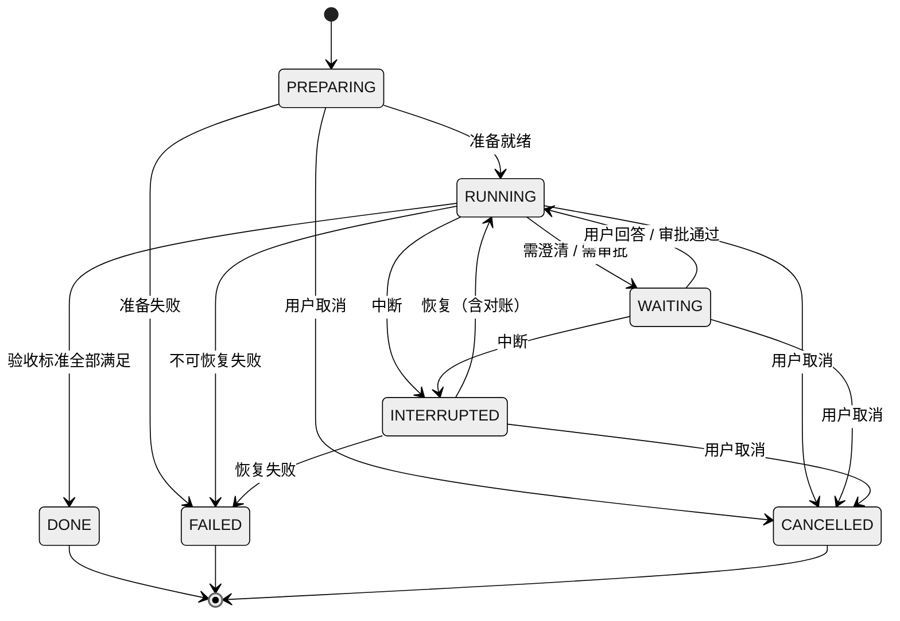
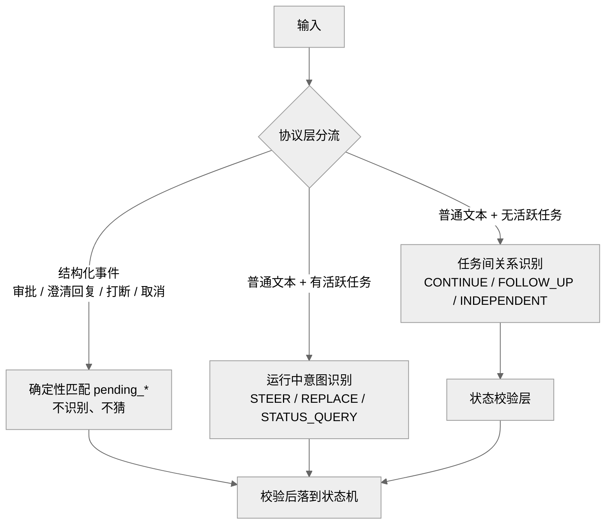
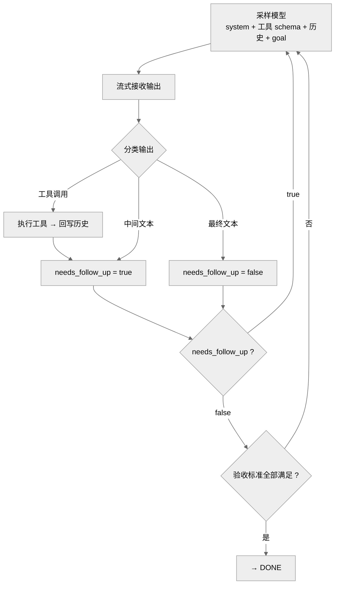
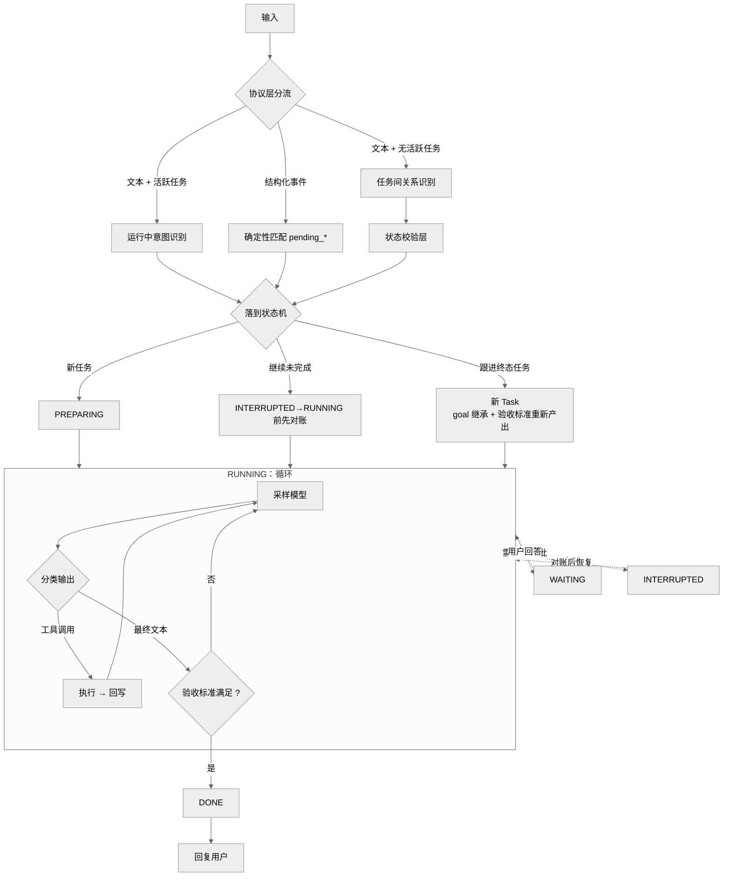

# TSM-Agent 流程与状态机重设计 SPEC（精简版 v2）

> 目标：**先把框架搭牢**——只保留必要的状态与流程。
> 判据可机械执行，不凭感觉；每一层都必须能回答「下一步做什么」。
> 参考：状态管理框架（识别/校验分家、意图锚点、显式状态机）与 Codex（协议层事件分流、needs_follow_up 循环）。

---

## 0. 版本说明

### v1 的 5 个缺陷（作废）

| # | v1 的问题 |
|---|---|
| 1 | 只画了「任务之间」的输入，漏了「任务运行中」的输入 |
| 2 | 没区分「结构化事件」和「普通文本」，把审批/澄清回复也塞进识别层 |
| 3 | 缺「意图锚点」 |
| 4 | CLARIFY 无兜底，可能反复追问 |
| 5 | 恢复路径没画对账 |

### v2 的两个简化决策

1. **状态机 19 → 7**（用三条判据机械推导，见 §1）
2. **去掉 Outcome 层**，改为 **Task 级验收标准**（`TaskAcceptanceCriterion` 已存在，直接复用）
   → 连带去掉 `OutcomeBindingAction/Reason`、`execution_focus`，**P037~P046 绑定问题家族根除**

---

## 1. 设计判据（三条）

| 判据 | 含义 |
|---|---|
| **1. 单一后继 → 合并** | 只有一个后继的状态不必独立存在 |
| **2. 后继相同 → 合并** | 两个状态后继完全一样，说明没有区别 |
| **3. 可用数据表达 → 不必是状态** | 「在等什么」用 `pending_*` 数据表达即可 |

### 判据 1、2 的实测结果

```
CREATED → INTAKE → RESOLVING_PROJECT → SELECTING_EXTENSIONS → ROUTING   （5 个单链）
INTERRUPTING → INTERRUPTED                                              （单一后继）
CONFLICT → RESUMING                                                     （单一后继）
FINALIZING → SUCCEEDED                                                  （单一后继）
EXECUTING 与 RUNNING_WORKFLOW：后继集合完全相同                          （重复）
```

### 判据 3 的收获

- `AWAITING_USER` / `AWAITING_APPROVAL` → 合成 `WAITING`，等什么看 `pending_clarification` / `pending_approval`
- `PLANNING` / `VERIFYING` → 都是「在干活」，并入 `RUNNING`

---

## 2. 最小状态机（7 个，实际流转只有 4 个）



| 状态 | 唯一确定的「下一步」 |
|---|---|
| `PREPARING` | 做准备（项目解析、扩展选择、路由） |
| `RUNNING` | 跑循环（规划 → 执行 → 验证都在这里） |
| `WAITING` | 等用户输入 |
| `INTERRUPTED` | 等恢复 |
| `DONE` / `FAILED` / `CANCELLED` | 结束 |

> **判据验证**：每个状态都能唯一回答「下一步做什么」；不满足这条的状态一律不算必要。

---

## 3. 状态转换表（确定性校验）

| 事件 | 前置 | 目标 | 校验条件 |
|---|---|---|---|
| 准备就绪 | `PREPARING` | `RUNNING` | 项目/扩展/路由完成 |
| 需澄清 | `RUNNING` | `WAITING` | 写入 `pending_clarification`（同时只能有一个） |
| 需审批 | `RUNNING` | `WAITING` | 写入 `pending_approval`（同时只能有一个） |
| 澄清回复 | `WAITING` | `RUNNING` | **必须匹配** `pending_clarification`，清空后进入 |
| 审批通过 | `WAITING` | `RUNNING` | **仅显式 approval 协议**；普通文本永不生效 |
| 验收满足 | `RUNNING` | `DONE` | 全部 acceptance criteria 满足 |
| 中断 | `RUNNING`/`WAITING` | `INTERRUPTED` | 记录 checkpoint |
| 恢复 | `INTERRUPTED` | `RUNNING` | **先对账**未决工具调用（见 §8） |
| 取消 | 任意非终态 | `CANCELLED` | — |

---

## 4. 输入三通道（先分流，再识别）

**核心**：不是所有输入都要「识别」。先按来源分流，只有普通文本才走语义识别。



| 通道 | 来源 | 处理 | 是否用模型 |
|---|---|---|---|
| **① 结构化事件** | UI 控件（点"批准"、答澄清、按 Esc） | 直接匹配 `pending_*`，确定性处理 | ❌ 不用 |
| **② 运行中文本** | 打字（任务正在跑） | 运行中意图识别 | ✅ |
| **③ 任务间文本** | 打字（任务未跑） | 任务关系识别 | ✅ |

### 通道 ①：结构化事件（对齐 Codex 的 `Op` 类型）

审批 / 澄清回复 / 权限响应在客户端就是不同控件，**天生带类型**，不需要"从文本识别"。
这消除了 v1 缺陷 2 的 bug：澄清回答不会被当成新文本重新识别。

### 通道 ②：运行中意图（对齐 Codex 的 `start_or_steer`）

| 意图 | 含义 |
|---|---|
| `STEER` | 给当前任务加约束/方向 |
| `REPLACE` | 改变当前目标 |
| `STATUS_QUERY` | 只问进度 |
| `UNCERTAIN` | → CLARIFY |

### 通道 ③：任务间关系（含终态可跟进）

| relation | 含义 | 允许的 source |
|---|---|---|
| `INDEPENDENT` | 全新独立任务 | 必须 `None` |
| `CONTINUE` | 接着**未完成**任务继续 | 必须非终态 |
| `FOLLOW_UP` | 基于**任意**任务（**含 FAILED/SUCCEEDED**）开新任务 | 任意 |
| `UNCERTAIN` | 无法判定 | 必须 `None` → CLARIFY |

> **关键**：识别层**永远不被任务状态短路**。只有「会话完全没有历史」才允许直接判 `INDEPENDENT`。

---

## 5. RUNNING 内部循环



**结束判断是双重条件**：

1. 模型不再要工具（`needs_follow_up = false`），**且**
2. 全部 acceptance criteria 满足

> 只满足 1 不满足 2 → 继续循环。这从机制上挡住「只给方案就结束」。

---

## 6. 任务规格与验收标准（代替 Outcome）

### 6.1 简化后的结构

```python
Task
  ├─ goal        : str                          # 意图锚点（§7）
  ├─ acceptance  : tuple[TaskAcceptanceCriterion, ...]   # 验收标准（复用现有类型）
  └─ state       : PREPARING | RUNNING | WAITING | INTERRUPTED | DONE | FAILED | CANCELLED
```

```python
# 复用现有类型（core/task_spec.py:648）
@dataclass(frozen=True, slots=True)
class TaskAcceptanceCriterion:
    criterion_id: str
    description: str
    verification_kind: TaskCriterionKind   # 见下
    evidence_reference: str | None = None

class TaskCriterionKind(StrEnum):
    WORKSPACE_INTEGRITY  = "workspace_integrity"    # 工作区变更一致
    POST_MUTATION_COMMAND = "post_mutation_command" # 变更后有成功的验证命令
    EVIDENCE_REFERENCE   = "evidence_reference"     # 有可追溯证据
```

### 6.2 对比：去掉的是什么

| 保留 | 去掉 |
|---|---|
`goal` | `TaskOutcomeProposal` / `TaskOutcomeSnapshot` |
`TaskAcceptanceCriterion` | `TaskOutcomeStatus`（9 状态） |
`TaskCriterionKind` | `OutcomeBindingAction` / `OutcomeBindingReason` |
| | `TaskExecutionFocus`（执行焦点） |

**收益**：工具调用不再需要"绑定到某个 Outcome"，`build_tool_call` 只需回答"是不是工具调用"（对齐 Codex）。**P037~P046 那一整类绑定歧义问题从根上消失。**

### 6.3 实施类目标的校验（修 P048）

planner 产出验收标准后，Runtime 做一次**确定性**校验：

```
若 goal 属实施类（实施/修复/构建/写/改/部署…）：
    验收标准必须至少含一条 WORKSPACE_INTEGRITY 或 POST_MUTATION_COMMAND
    否则 → 拒绝并要求重新规划
```

这条校验落在 Kernel，**不依赖 prompt 自律**。

---

## 7. 意图锚点（goal）

| 规则 | 说明 |
|---|---|
| `goal` 创建时确定 | 之后**模型不能静默改写** |
| 用户明确改目标 | 走通道 ② 的 `REPLACE` → 生成新的 goal 版本并记录来源 |
| 作用 | 长对话中防跑偏的锚点；也是 planner 产出验收标准的依据 |

---

## 8. 恢复与对账（机制已有，补进流程）

`INTERRUPTED → RUNNING` 不是直接恢复，必须先对账：

```
INTERRUPTED
  → 检查未决工具调用
    ├─ 有 UNKNOWN_OUTCOME 或 非幂等 RUNNING
    │    → RECONCILE_REQUIRED：先核实真实结果
    │         ├─ 确认已提交 → 记为 COMMITTED，不重跑
    │         └─ 确认未发生 → 允许重跑
    └─ 无 → EXACT_RESUME：直接恢复
```

**现有机制（无需新建，只需接线）**：
- `ToolExecutionRecord.idempotency` / `idempotency_key` / `reconciled_outcome`
- `ToolCommitState.UNKNOWN_OUTCOME`
- `ToolExecutionRecord.reconcile(outcome, reference)`（`execution.py:121`）
- `_checkpoint_has_unknown_side_effect`（`kernel.py:1350`）
- `SessionResumeSafety.RECONCILE_REQUIRED`

---

## 9. 端到端主流程（完整）



---

## 10. 映射表（现有 → v2）

### 10.1 状态映射

| v2 状态 | 现有 TaskState |
|---|---|
| `PREPARING` | CREATED / INTAKE / RESOLVING_PROJECT / SELECTING_EXTENSIONS / ROUTING |
| `RUNNING` | PLANNING / EXECUTING / RUNNING_WORKFLOW / VERIFYING / FINALIZING |
| `WAITING` | AWAITING_USER / AWAITING_APPROVAL（等什么看 `pending_*`） |
| `INTERRUPTED` | INTERRUPTING / INTERRUPTED / RESUMING / CONFLICT |
| `DONE` | SUCCEEDED |
| `FAILED` | FAILED |
| `CANCELLED` | CANCELLED |

> **渐进策略**：可先只在**对外**（UI / 模型 / 事件）收敛成 7 个，内部保留现有状态，避免一次性大改。

### 10.2 需删除 / 迁移的模块

| 模块 | 处置 |
|---|---|
| `TaskOutcomeProposal` / `TaskOutcomeSnapshot` | 删除 |
| `TaskOutcomeStatus`（9 状态） | 删除 |
| `OutcomeBindingAction` / `OutcomeBindingReason` | 删除 |
| `TaskExecutionFocus` / `select_task_outcomes` | 删除 |
| `request_task_outcome_completion` | 改为「验收标准评估」 |
| `_task_outcome_completion_gaps` | 改为基于 acceptance criteria |
| `TaskSpecSnapshot.outcomes` | 删除，只留 `goal` + `acceptance_criteria` |
| `TaskAcceptanceCriterion` / `TaskCriterionKind` | **保留复用** |
| 对账相关（`ToolExecutionRecord` / `UNKNOWN_OUTCOME` / `reconcile`） | **保留**，补进恢复流程 |

---

## 11. 重构顺序（一步一验证）

| 步 | 内容 | 验证 |
|---|---|---|
| **1** | 输入三通道分流（结构化事件不走识别） | 澄清回复不再被重新识别 |
| **2** | 识别层去状态短路：`not candidates` 不再直接判 `INDEPENDENT`；识别器不可用 → `CLARIFY` | 无关/相关输入都经过识别 |
| **3** | 校验层支持终态 `FOLLOW_UP` | FAILED 任务可被跟进 |
| **4** | 引入 acceptance criteria 完成判定（与现有 outcome 判定并行） | 双重条件结束生效 |
| **5** | planner 改为产出 acceptance criteria + 实施类后置校验 | P048 根因消除 |
| **6** | 删除 Outcome / binding / execution_focus | 全量回归 |
| **7** | Task 状态对外收敛为 7 个 | UI / 事件 / 模型一致 |
| **8** | 恢复流程接入对账 | 中断恢复不重复副作用 |

> 每步都跑 `tests/` 全量回归，并确认失败项与改动前基线一致（当前基线：5 项 PTY 环境 + 3 项工作区既有失败）。
