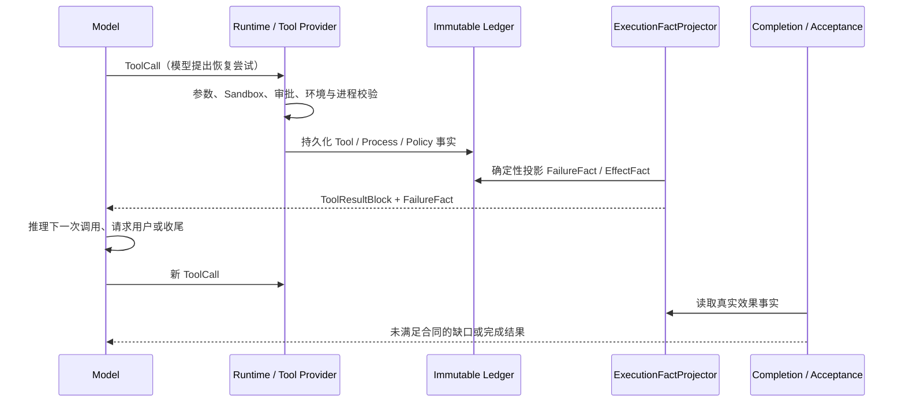

# Runtime 事实投影与模型恢复编排 SPEC

状态：草案，待评审  
关联问题：`实测记录与优化问题本.md` P052、P044  
关联 Spec：`完成判定改造SPEC.md`、`Runtime执行环境错误恢复与重新验证SPEC.md`  
替代方向：废弃“Runtime 自动修复参数并重试”的设计；保留 Runtime 的事实采集、约束校验、审计和安全终止职责。

---

## 1. 背景与问题

真实 Task `task-0cd59dbebafd4ba4ad0788546784a519` 在运行 pytest 时经历了三次不同的前置失败：sandbox 拒绝相对 executable、受治理环境中没有 `python`、绝对 cwd 不符合工具参数合同。模型随后提出了首次同时满足已知约束的组合：绝对 `.venv/bin/python` 加相对 `cwd="."`。

该第四次调用尚未启动进程，就被 `PlanGuard.no_progress_limit=3` 判为 `STOP_NO_PROGRESS` 并取消。因此没有任何 pytest 实际结果。最终回答只能声明未验证，但现有完成判定仍可能把“成功输出说明”误当作 Task 成功。

问题不在于 Runtime 没有记录错误，也不在于模型完全忽略错误；问题是：

1. Runtime 的失败事实缺少统一、可重放的投影；
2. no-progress 以语义类别和零证据为主，无法识别“首次满足新增事实约束的恢复尝试”；
3. 完成判定没有把“命令实际效果”与“调用层 ToolResult 成功”严格分开；
4. 旧方案把 Runtime 推向自动合成 argv/cwd/环境变量，职责越界且不可泛化。

---

## 2. 目标与非目标

### 2.1 目标

1. Runtime 从不可变 ledger 中确定性投影命令/工具的失败事实，不生成业务恢复方案。
2. 模型读取事实后自行生成下一次 ToolCall、请求用户输入或报告无法恢复。
3. 对首次满足新增事实约束的调用，允许一次真实执行；no-progress 不得在执行前取消它。
4. 将命令的“调用完成”与“业务效果成功”区分，并供完成判定与最终验收复用。
5. 所有停止、取消、失败、重试和真实执行结果可由事件回放重建。

### 2.2 非目标

- 不自动改写模型提交的 argv、cwd、环境变量或网络地址；
- 不按 Python、pytest、git、npm 等具体工具名硬编码恢复规则；
- 不放宽 Sandbox、审批、凭据或工作区边界；
- 不让模型直接修改 Runtime 事实、执行记录或 no-progress 计数；
- 不以自然语言错误消息作为状态机唯一依据。

---

## 3. 职责边界



| 组件 | 负责 | 不负责 |
|---|---|---|
| Runtime / Tool Provider | 参数校验、Sandbox、进程启动、持久化原始事实 | 选择下一次 argv/cwd/环境变量 |
| ExecutionFactProjector | 将 ledger 投影为稳定事实、约束和效果状态 | 推荐修复步骤、解释业务语义 |
| Model | 合并事实、提出恢复 ToolCall、请求用户决策 | 伪造事实或绕过安全边界 |
| PlanGuard | 判定是否为真正重复且无新事实的尝试 | 根据工具名猜测恢复方案 |
| Completion / Acceptance | 以真实效果事实验证交付合同 | 以最终文本替代命令/测试成功证据 |

核心原则：**Runtime 提供事实，模型生成策略，Runtime 验证策略是否满足事实约束。**

---

## 4. 事实模型

### 4.1 新增只读投影：`ExecutionFact`

新增纯函数模块：`src/tsm_agt/core/execution_facts.py`。输入是既有 `ToolExecutionRecord`、`ToolResult`、`ProcessResult`、`ToolSpec` 与相关事件；不做 IO、不调用模型、不写状态。

```python
class ExecutionStage(StrEnum):
    ARGUMENT_VALIDATION = "argument_validation"
    SANDBOX_PRECHECK = "sandbox_precheck"
    PROCESS_START = "process_start"
    PROCESS_EXIT = "process_exit"
    RUNTIME_POLICY = "runtime_policy"

class EffectStatus(StrEnum):
    SUCCEEDED = "succeeded"
    FAILED = "failed"
    UNKNOWN = "unknown"

@dataclass(frozen=True, slots=True)
class FailureFact:
    fact_id: str
    execution_id: str
    tool_name: str
    stage: ExecutionStage
    code: str
    observed: Mapping[str, Any]
    constraints: tuple[str, ...]
    process_started: bool
    fact_fingerprint: str

@dataclass(frozen=True, slots=True)
class ExecutionFact:
    execution_id: str
    tool_name: str
    effect: ToolEffect
    authority: ToolResultAuthority
    effect_status: EffectStatus
    process_started: bool
    process_exit_code: int | None
    failure: FailureFact | None
```

### 4.2 事实字段要求

`FailureFact` 只能表达 Runtime 已验证的内容：

| 失败阶段 | 可投影事实示例 | 禁止表达 |
|---|---|---|
| 参数校验 | `cwd` 必须采用 workspace-relative 形式 | “请改成 `.`” |
| Sandbox 预检 | 相对 executable 被当前策略拒绝 | “请改为某个绝对路径” |
| 进程启动 | `python` 未在受治理环境中找到 | “请使用 `.venv/bin/python`” |
| 进程退出 | 已启动、exit code、stderr/stdout 摘要 | “修复某个测试断言” |
| Runtime policy | 调用被 no-progress / 预算 / Replace 取消 | “换一种业务实现” |

约束字符串是**已验证条件**，不是推荐动作。若 Runtime 没有证据，就不生成该字段。

### 4.3 ToolResult 暴露方式

保留现有 `ToolResult` 兼容字段，并在 `meta.execution_facts` 中附加可重放事实摘要：

```json
{
  "ok": false,
  "error_code": "EXECUTABLE_NOT_FOUND",
  "meta": {
    "execution_facts": {
      "stage": "process_start",
      "process_started": false,
      "constraints": ["bare executable is absent from governed environment"],
      "fact_fingerprint": "..."
    }
  }
}
```

模型看到的是事实对象；模型可提出任意合法下一次调用，Runtime 继续按安全合同验证。

---

## 5. 模型恢复编排

### 5.1 模型输入规则

Agent Loop 在下一轮向模型提供：

1. 原始 ToolResult；
2. `ExecutionFact` 摘要；
3. 仍未满足的 Task/验收合同；
4. 已尝试的规范化调用指纹与实际结果状态；
5. 可见工具和现有审批状态。

Runtime 的固定提示只约束事实使用方式：

```text
上一轮 Runtime 事实是权威记录。根据事实决定下一次合法调用、请求用户信息或报告无法恢复；
不得声称未启动的进程已经执行，也不得把 Runtime 约束改写为已验证的建议路径。
```

不向模型注入“把参数改成 X”的 Runtime 恢复脚本。

### 5.2 模型可选动作

| 情况 | 模型动作 |
|---|---|
| 能根据事实提出不同且合法的调用 | 生成新的 ToolCall |
| 需要用户凭据、访问权或业务选择 | `core.request_input` |
| 已有真实失败且无可用安全替代 | 输出不完整/阻塞说明 |
| 命令已实际成功 | 进入后续验证或最终回答 |

模型的 ToolCall 是假设；Runtime 不信任该假设，只验证参数、权限、事实约束与安全策略。

---

## 6. 事实感知的 no-progress 策略

### 6.1 当前缺陷

当前 `PlanGuard` 在 `semantic_family=EXECUTE_VERIFICATION` 下，连续零证据会跨不同参数调用延续计数。第三次预检失败后，第 4 次首次满足已知约束的调用在启动前被取消。

### 6.2 新状态：`RecoveryProgressState`

替代仅依赖语义签名的终止计数，新增 checkpoint 可持久化状态：

```python
@dataclass(frozen=True, slots=True)
class RecoveryProgressState:
    goal_slice_id: str = ""
    attempted_fingerprints: tuple[str, ...] = ()
    observed_fact_fingerprints: tuple[str, ...] = ()
    repeated_terminal_attempts: int = 0
```

其中：

- `attempt_fingerprint`：工具名、规范化参数、当前 goal slice、当前已知失败事实集合；
- `fact_fingerprint`：由 Runtime 投影，代表一个新观察到的真实约束或结果；
- `repeated_terminal_attempts`：仅计算已启动后终态相同，或已知约束完全不变的重复预检失败。

### 6.3 判定规则

```text
收到新 ToolCall
  ↓
Runtime 校验并比较已知 FailureFact
  ↓
调用是否首次满足至少一个此前未满足的事实约束？
  ├─ 是 → 标记 CORRECTED_UNTRIED，必须允许一次真实执行
  └─ 否 → 是否与已实际终态的 attempt_fingerprint 相同？
       ├─ 是 → 累加 repeated_terminal_attempts
       └─ 否 → 允许执行并记录新事实
```

`STOP_NO_PROGRESS` 仅在以下条件全部满足时可发生：

1. 当前调用不是 `CORRECTED_UNTRIED`；
2. 当前调用已与此前完整规范化尝试等价，或重复违反同一已知预检约束；
3. 没有产生新的 `FailureFact`、真实进程结果、工作区变化或用户输入；
4. 重复计数达到配置阈值。

因此，`absolute project interpreter + cwd="."` 在前序事实分别确认“相对 executable 不允许”“bare python 不存在”“cwd 形式不合法”后，必须被视为新的未尝试组合，不能在 process start 前被 stop。

### 6.4 停止后的状态

当真正满足 stop 条件：

- Runtime 取消尚未开始的 pending call，并持久化 `CANCELLED_BY_RUNTIME_POLICY` 事实；
- 最终模型回合禁止新增工具调用；
- Task 进入“未完成但可解释”的完成判定路径；
- 若缺少用户才能提供的事实，转 `AWAITING_USER`；否则报告不可恢复/预算耗尽；
- **禁止**把 policy 取消当成命令已经执行。

---

## 7. 与完成判定的协同

本 Spec 不替代 `完成判定改造SPEC.md`，两者的接口是 `ExecutionFact`。

### 7.1 命令效果合同

新增/扩展 Task 验收类型：`command_exit_success`。它适用于“测试、构建、推送、校验命令本身是用户目标或验证目标”的场景，不能继续错误复用 `post_mutation_command`。

```text
command_exit_success 通过条件：
- 命令实际到达 process start；
- foreground ProcessResult.succeeded = true；
- exit_code = 0；
- 命令匹配该验收合同的规范化约束。
```

没有 mutation 时，`post_mutation_command=NOT_APPLICABLE` 不能满足 `command_exit_success`。

### 7.2 状态映射

| 事实 | 允许的最终状态 |
|---|---|
| 命令未启动 / 被 Runtime policy 取消 | 不得 `SUCCEEDED` |
| 命令启动但 exit code 非 0 | 不得 `SUCCEEDED` |
| 所有 required command contracts 满足 | 可进入最终验收 |
| 缺用户凭据/授权且无替代 | `AWAITING_USER` 或明确 `BLOCKED` |
| 模型仅输出“未验证”文本 | 只能说明现状，不能关闭合同 |

---

## 8. 实施边界与迁移

### 8.1 实施顺序

1. 实现纯函数 `ExecutionFactProjector` 与事件回放测试。
2. 在 process/sandbox/参数校验路径投影 `FailureFact`，不改变现有安全拒绝。
3. 将投影结果写入 ToolResult meta 与 checkpoint，不增加模型生成的 Runtime 状态。
4. 引入 `RecoveryProgressState`，替换 PlanGuard 对恢复类 `EXECUTE_VERIFICATION` 的语义级累加。
5. 接入 `CompletionReadinessProbe` / Final Acceptance，新增 `command_exit_success` 合同。
6. 删除或标记 `Runtime执行环境错误恢复与重新验证SPEC.md` 中“Kernel 自动参数修复”的过期设计。

### 8.2 兼容性

- 历史 ToolResult 没有 `execution_facts` 时，投影器按既有 `error_code`、`ProcessResult` 和执行事件保守推导；无法判断时标记 `UNKNOWN`，不自动重试。
- `ToolResult.ok` 的调用层语义保持不变；业务效果由 `ExecutionFact.effect_status` 表达。
- 旧 checkpoint 没有 `RecoveryProgressState` 时默认空状态；首次恢复只记录事实，不提前 stop。

---

## 9. 方案验收口径

1. Runtime 不输出 argv/cwd/环境变量的自动修复方案，仅输出已验证事实与约束。
2. 模型可基于连续失败事实提出新的合法 ToolCall，Runtime 不替模型改写参数。
3. 首次满足新增事实约束的调用必定获得一次真实执行机会。
4. 同一无效预检或同一已启动终态的重复尝试达到阈值后，才产生 `STOP_NO_PROGRESS`。
5. `CANCELLED_BY_RUNTIME_POLICY`、未启动、exit non-zero 均不能满足 `command_exit_success`。
6. “测试通过 / push 成功”等结果必须由对应 `ExecutionFact` 的真实效果闭合，不得仅由最终自然语言回复闭合。
7. 所有 FailureFact、恢复尝试、取消和最终验收结论可从 Task 事件与 checkpoint 回放重建。

---

## 10. 风险与待决策项

| 风险/待决策 | 处理原则 |
|---|---|
| 事实投影字段包含敏感 stderr | 仅保存已有脱敏 ToolResult 中允许的摘要；不增加原始凭据内容 |
| 模型持续提出不同但低价值的参数变体 | 以事实约束满足集合和规范化 attempt fingerprint 限制，而非只看自然语言语义 |
| 预检失败是否算一次尝试 | 首次新事实不计重复；已知同约束的相同预检失败可计重复 |
| 命令副作用 | 非幂等命令仍遵守 approval/idempotency；“允许一次 corrected attempt”不绕过审批 |
| 完成判定与现有 Spec 重叠 | 本 Spec 只提供 ExecutionFact 与恢复尝试边界；最终成功状态由完成判定改造消费该事实 |
