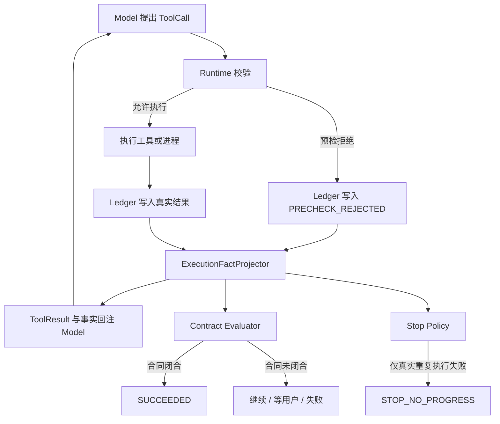

# 执行事实恢复与完成判定精简 SPEC V2

状态：草案，待实施  
关联问题：`实测记录与优化问题本.md` P044、P052  
替代范围：本文件替代此前关于“Runtime 自动修复参数”和“基于模型计划的恢复作用域”的设计方向。

---

## 1. 决策摘要

系统只保留三层：

```text
Runtime：记录并投影事实
Model：基于事实提出下一次策略
Completion：基于合同和事实决定是否成功
```

本方案解决两类真实故障：

1. 命令未启动、被 Runtime 取消或 exit 非 0，Task 却因最终回复文本存在而显示成功；
2. 模型提出新的命令组合时，Runtime 在该组合真正执行前以 `no-progress` 取消它。

本方案不引入：

- Runtime 自动 argv/cwd/env 修复；
- `goal_slice`、恢复工作流或恢复状态机；
- 语义重试判断、文本相似度、失败知识库；
- 工具名特例，例如 pytest、git、npm。

---

## 2. 职责边界

| 层 | 负责 | 不负责 |
|---|---|---|
| Runtime / Tool Provider | 参数、审批、Sandbox、进程、取消和原始结果 | 解释业务失败、生成修复方案 |
| ExecutionFactProjector | 从不可变 ledger 投影稳定事实 | 写新 ledger、调用模型、规划恢复 |
| Model | 阅读事实，提出新 ToolCall、请求用户或收尾 | 伪造事实、绕过策略 |
| Stop Policy | 基于真实执行和合同推进限制重复尝试 | 判断模型“是否理解错误” |
| Completion | 校验 acceptance contract 是否由真实事实满足 | 使用模型叙述代替成功证据 |

核心约束：**Runtime 只知道“发生了什么”，Model 才知道“下一步应该做什么”。**

---

## 3. 唯一事实源与纯投影

现有 Runtime ledger 已经是唯一持久化事实源：

```text
ToolExecutionRecord
ToolResult
ProcessResult
Policy / Approval / Cancel Event
Mutation Journal
```

新增 `ExecutionFactProjector`，但不新增第二份 append-only 账本。

```text
ledger/events --纯函数投影--> ExecutionFact
```

Projector 必须：

- 不做 IO；
- 不调用模型；
- 不改变 checkpoint；
- 不产生恢复建议；
- 可由任意 Task event 回放重建。

---

## 4. 最小执行事实模型

### 4.1 调用状态

```python
class InvocationState(StrEnum):
    PRECHECK_REJECTED = "precheck_rejected"
    EXECUTED = "executed"
    CANCELLED = "cancelled"
    UNKNOWN = "unknown"
```

| 状态 | 含义 |
|---|---|
| `PRECHECK_REJECTED` | 参数、Sandbox、审批或启动前条件阻止了调用；没有得到业务执行结果 |
| `EXECUTED` | 调用已到达执行器；进程是否成功由结果状态表达 |
| `CANCELLED` | 用户、Replace 或 Runtime policy 在执行前/执行中取消 |
| `UNKNOWN` | 结果无法安全确定 |

### 4.2 结果状态

```python
class ResultState(StrEnum):
    NONE = "none"
    SUCCESS = "success"
    FAILURE = "failure"
    UNKNOWN = "unknown"
```

`ResultState` 表达真实效果，不等同于 `ToolResult.ok`：

```text
ToolResult.ok=true
+ ProcessResult.succeeded=false
=> ResultState.FAILURE
```

### 4.3 粗粒度失败边界

```python
class FailureFamily(StrEnum):
    POLICY_BLOCKED = "policy_blocked"
    VALIDATION_FAILED = "validation_failed"
    EXECUTION_FAILED = "execution_failed"
    USER_BLOCKED = "user_blocked"
    INFRASTRUCTURE_ERROR = "infrastructure_error"
```

它只标记 Runtime 边界，不描述开放业务语义。例如“pytest import error”和“GitHub key 无权限”仍由模型依据原始 ToolResult 推理。

### 4.4 投影对象

```python
@dataclass(frozen=True, slots=True)
class ExecutionFact:
    execution_id: str
    tool_name: str
    payload_hash: str
    authority: ToolResultAuthority
    invocation_state: InvocationState
    result_state: ResultState
    failure_family: FailureFamily | None
    process_started: bool
    exit_code: int | None
```

必要事实示例：

| 现象 | InvocationState | ResultState | FailureFamily |
|---|---|---|---|
| cwd 参数不合法 | `PRECHECK_REJECTED` | `NONE` | `VALIDATION_FAILED` |
| sandbox 拒绝 executable | `PRECHECK_REJECTED` | `NONE` | `POLICY_BLOCKED` |
| executable 不存在，进程未启动 | `PRECHECK_REJECTED` | `NONE` | `EXECUTION_FAILED` |
| pytest exit 1 | `EXECUTED` | `FAILURE` | `EXECUTION_FAILED` |
| pytest exit 0 | `EXECUTED` | `SUCCESS` | `None` |
| no-progress 取消 | `CANCELLED` | `NONE` | `POLICY_BLOCKED` |

---

## 5. 模型恢复循环

每次 ToolCall 结束后，下一轮模型同时接收：

1. 原始 `ToolResult`；
2. 对应 `ExecutionFact`；
3. 尚未满足的 acceptance contracts；
4. 当前可见工具、审批和用户交互状态。

模型可以：

```text
- 提出新的 ToolCall；
- 请求用户提供凭据、路径或业务选择；
- 在无安全替代时报告未完成。
```

Runtime 只验证下一次调用是否符合当前 ToolSpec、审批与安全边界；**不自动改写参数。**

---

## 6. 极简 no-progress 规则

### 6.1 基本原则

```text
预检拒绝不是一次真实执行。
真实执行失败才可能消耗“执行无进展”次数。
```

因此，参数错误、Sandbox 拒绝、executable 不存在、审批未通过等 `PRECHECK_REJECTED` 不得因为“同属验证命令”而直接累加执行无进展次数。

### 6.2 精确重复处理

对于同一 ToolSpec 和同一 `payload_hash`：

```text
已有 PRECHECK_REJECTED
→ 复用已有失败事实，不重新执行
```

这是一种确定性去重，不需要语义相似度判断，也不消耗进程执行次数。

对于不同 `payload_hash`：

```text
允许模型提出并执行新调用
→ 由全局 model/tool budget 负责总量上界
```

这保证模型可以把多个已知事实组合成一次新尝试。例如前三次分别暴露 executable、环境和 cwd 条件时，第四次不同参数组合必须有机会到达 process start。

### 6.3 真正的 no-progress

仅当以下条件同时成立时，才允许 `STOP_NO_PROGRESS`：

1. 某个尚未满足的 acceptance contract 存在；
2. 当前或历史调用已处于 `EXECUTED`，而非 `PRECHECK_REJECTED`；
3. 真实执行结果没有推进该合同；
4. 相同 `payload_hash` 已重复得到同类终态，或该合同的实际执行失败次数达到阈值；
5. 没有新的成功验证事实、工作区 mutation、用户输入或合同变化。

没有 acceptance contract 的探索型读取不使用这套执行停止计数，继续由现有全局探索预算限制。

### 6.4 当前代码替换点

当前 `PlanGuard` 在调用前用 `semantic_signature` / `semantic_family` 与零证据计数决定是否 stop。该逻辑应改为：

```text
调用前：仅做 exact precheck 去重和普通预算检查
调用后：根据 ExecutionFact 与 acceptance contract 更新执行无进展计数
```

因此 Runtime 不再凭“都是 EXECUTE_VERIFICATION”在 process start 前取消新的参数组合。

---

## 7. 完成判定：合同必须闭合

### 7.1 新验收类型

新增：

```python
COMMAND_EXIT_SUCCESS
```

用于“测试通过、构建成功、push 成功、验证命令成功”本身是交付条件的任务。

通过条件：

```text
- 绑定到该合同的 execution fact 为 EXECUTED；
- ResultState 为 SUCCESS；
- foreground process 的 exit_code 为 0；
- 合同选择的命令记录与当前 Task 匹配。
```

不应继续把纯命令目标误建模为 `POST_MUTATION_COMMAND`。后者在没有 mutation 时是 `NOT_APPLICABLE`，不能证明 pytest 或 push 成功。

### 7.2 合同与执行记录的关系

合同不依赖模型最终文本，也不能随机匹配任意成功命令。

```text
TaskSpec criterion
→ 稳定 criterion_id
→ Runtime 在执行记录中保留可验证的合同关联
→ Verifier 只检查该合同关联的 ExecutionFact
```

模型可在发现具体命令后通过现有受校验的 TaskSpec 更新能力补充/收窄合同；Runtime 只校验 criterion 存在、工具类型允许、关联不可伪造。

### 7.3 最终状态

| ExecutionFact / contract 状态 | 是否允许 `SUCCEEDED` |
|---|---|
| `PRECHECK_REJECTED` | 否 |
| `CANCELLED` | 否 |
| `EXECUTED + FAILURE` | 否 |
| `EXECUTED + SUCCESS` 且所有 required contracts 满足 | 是 |
| 模型仅输出“尚未验证”文本 | 否 |

---

## 8. 目标流程



---

## 9. 实施顺序

### 阶段 1：事实投影

1. 实现唯一的 `ExecutionFactProjector`；
2. 映射参数校验、Sandbox、进程启动、进程退出和 policy 取消；
3. 将摘要放入 ToolResult / checkpoint；
4. 不改变现有模型策略。

### 阶段 2：完成安全门

1. 引入 `COMMAND_EXIT_SUCCESS`；
2. Completion / Final Acceptance 消费 `ExecutionFact`；
3. 未启动、取消、exit 非 0 一律不能闭合命令合同；
4. 修复 pytest、git push、构建等命令目标的假成功。

### 阶段 3：停止策略

1. 移除执行类 no-progress 对 `semantic_signature` 的依赖；
2. 使用“真实执行结果 + 合同推进”更新停止计数；
3. 对相同预检拒绝做精确去重；
4. 保留全局 model/tool budget，防止无限不同参数尝试。

---

## 10. 验收口径

1. Runtime 不生成 argv/cwd/env 的修复方案；
2. 不新增第二份持久化执行事实账本；
3. 预检拒绝不会消耗真实执行无进展次数；
4. 相同预检拒绝调用被确定性复用，不重复执行；
5. 不同参数调用可获得真实执行机会，仍受全局预算限制；
6. 只有重复真实执行失败且合同未推进时才 `STOP_NO_PROGRESS`；
7. `PRECHECK_REJECTED`、`CANCELLED`、`EXECUTED + FAILURE` 不得满足 `COMMAND_EXIT_SUCCESS`；
8. 测试通过、构建成功、push 成功只能由关联 ExecutionFact 闭合，不能由最终回复文本闭合；
9. 所有状态可从现有 Task event 与 checkpoint 回放重建。
