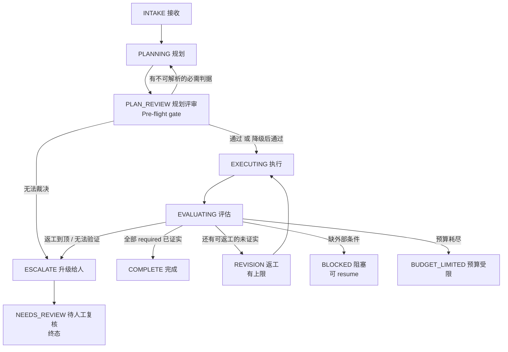

# 验收判定通用流程方案（Universal Acceptance Gate）

> 状态：设计草案
> 目的：把"任务到底完成了没有"这件事，从"模型说完成 / 系统卡住"改成
> **只由可核查的证据决定；查不了的东西降级，而不是卡死。**

---

## 0. 一句话结论

**计划（plan）永远不当成功门；判据（criterion）必须绑定到可核查的目标；
每个循环必须有上限；每种失败必须有一个终态并且能升级给人。**

---

## 1. 问题的通俗解释

把一次任务想成一次**装修验收**。

### 1.1 现在发生了什么

1. **工头（Planner）** 在开工前写了一张验收单（`acceptance_criteria`）。
2. 系统规定："每张验收单**必须**至少有一条验收标准。"
3. 但系统只提供三种"机器能查"的标准类型：墙有没有砌（workspace_integrity）、
   砌完有没有压测（post_mutation_command）、有没有一张存档照片（evidence_reference）。
4. 这次的任务其实是"**口头汇报一下进度**"，根本没有墙可砌。
   工头没办法，只好把"汇报要说清楚三点"这条**主观要求**，
   硬写成"请参考三号工地照片 `turn-xxx`"。
5. 验收员（Verifier）只会检查"这张照片编号**格式**对不对"，
   **不会**检查"汇报说清楚了没有"。而 `turn-xxx` 不是合法编号格式。
6. 于是：活其实干完了，汇报也写出来了，验收员判 **不通过（REPORT_BLOCKED）**。
7. 验收员的规则里还写着："不通过的时候，**不许再动手**（Do not call tools）。"
8. 同时系统把"不通过"翻译成了"**等你回话**"（AWAITING_USER）。
9. 用户回话 → 前台说"现在在等人，**不能处理你这句普通文本**"。

**三把锁叠在一起 = 死锁。**

```
锁 1：不可满足   → 三条 required 判据天生无法通过（引用非法，且不许修）
锁 2：不可恢复   → 该判据 recoverable = false，没有任何工具能关闭它
锁 3：不可输入   → 任务处于 AWAITING_USER，普通文本被前台规则直接拒绝
```

### 1.2 三句话根因

| 编号 | 根因 | 通俗说法 |
|---|---|---|
| R1 | 强制"每个任务都要有验收标准"，但只给机器可验证的类型 | 逼着工头把主观要求伪装成机器引用 |
| R2 | 判据在**规划期不校验**，只到**完工期**才发现引用无效 | 写完单子没人审，干完活才说单子写错了 |
| R3 | 判据无效后既不许修、又没有终态 | 门锁死了，还把人关在里面 |

**关键认识**：这次失败**不是**"模型输出对不上输入"，
而是**运行时（Runtime）自己造了一个不可能完成的合同，然后把自己锁死。**

---

## 2. 参考的开源结论（一句话版）

| 方案 | 计划/待办是否阻塞 | 真正的门在哪 | 不可验证时怎么办 |
|---|---|---|---|
| **Codex** | **否**（源码注释：plan 只是给模型记录、给客户端渲染，机械上"不做任何有用的事"） | goal 生命周期：`active / paused / blocked / usageLimited / budgetLimited / complete` | `blocked`（同一阻塞条件连续 ≥3 次），`budgetLimited` 既非成功也非失败 |
| **Claude Code** | **否**（TodoWrite 只是提示） | `/goal` = 每轮后一个独立小模型判断条件 | 三值 `Met / Not yet met / Impossible`；重试 3 次后 pause；连续无工具调用 → 交还控制权给人 |
| **Kiro** | **否**（核心流程靠人工逐任务 review） | hook（`decision:block`）/ Crew Task Runner（独立 reviewer 读 `git diff`） | 规划期改写歧义；不可验证降级为 `MANUAL_VERIFY_REQUIRED` |
| **Hermes** | 计划本身不门控 | `{id, criterion, verify_via, verify_hint}` 绑定冻结的 pytest nodeid | 规划期独立 verifier 用 `ac_testability` 打分，过不了就 `REQUEST_CHANGES` → 改 → 人工门 |
| **LangChain DeepAgents** | 无计划门 | rubric + LLM-as-judge 子代理 | 终态含 `max_iterations_reached / failed / grader_error`，**直接结束，绝不挂起** |

### 2.1 五家共识（最重要）

1. **计划 / 待办是工作记忆，永不当成功门。** 它的作用是给人和模型看进度，不是判定。
2. **判据必须绑定可核查的东西。** 要么是可执行检查（跑测试、看退出码），
   要么是耐久证据（事件、产物、mutation），要么是 rubric（评分量表）。
3. **每个循环有上限。** 返工次数、judge 迭代次数、停滞轮次，全都要封顶。
4. **失败有终态且能升级给人。** `Impossible` / `NEEDS_REVIEW` / `MANUAL_VERIFY_REQUIRED` /
   `blocked` / `budgetLimited`——都是一个明确的终点，不是一个无限等待。
5. **验证器必须能独立取证。** 不能只看模型的自我陈述（Claude Code 的 `/goal`
   只读对话记录，官方也承认对客观验证很弱，这是反面教材）。

---

## 3. 通用流程方案

### 3.1 三层分离（核心设计）

```
┌──────────────────────────────────────────────────────────────┐
│ Layer A · 计划层 Plan (advisory 提示性)                       │
│   todo / plan / 步骤 / 进度                                    │
│   作用：给模型和人看；永不参与"是否成功"的判定                  │
├──────────────────────────────────────────────────────────────┤
│ Layer B · 判据层 Criteria (contract 合同)                     │
│   每条判据是数据对象，绑定一个可核查目标 + 必需性                │
│   verify_via ∈ {executable, evidence, judgment}              │
├──────────────────────────────────────────────────────────────┤
│ Layer C · 门控层 Gate (decision 决策)                         │
│   收集判据结果 → 输出一个终态；带返工上限与升级路径              │
└──────────────────────────────────────────────────────────────┘
```

### 3.2 状态机



**终态集合**：
`COMPLETE` / `NEEDS_REVIEW` / `BLOCKED(可恢复)` / `BUDGET_LIMITED` / `CANCELLED` / `FAILED`。
**注意 `BLOCKED` 和 `BUDGET_LIMITED` 后面没有无限等待**——它们是明确的、可查询的状态，
恢复需要"外部状态变化 + 显式 resume"，而不是靠发一句普通文本碰运气。

### 3.3 判据的三种验证通道（verify_via）

| verify_via | 含义 | 证据强度 | 能否硬阻塞 | 例子 |
|---|---|---|---|---|
| `EXECUTABLE` | 跑一个命令/测试，看退出码 | 最强 | **能** | `pytest tests/x.py::test_y` 退出码 0 |
| `EVIDENCE` | 查一条耐久记录是否存在且成立 | 强 | **能** | `event:42` / `tool_call:abc` / `mutation:xyz` |
| `JUDGMENT` | 由评分量表（rubric）评审 | 弱 | **不能硬阻塞** | "汇报是否覆盖了这三点" |

**规则：`JUDGMENT` 判据可以参与最终验收，但绝不能产生"不可闭合的必需 gap"。**
它只能走"有界 judge → 通过 或 交给人复核"这条路。

### 3.4 七条不变量（Invariants）

```
INV-1  计划层不参与成功判定。
INV-2  每条 required 判据必须在 PLAN_REVIEW 期绑定到一个可解析的目标。
INV-3  required 判据必须"可闭合"：要么机器可验证，要么由 judge/人工路径承接。
       禁止出现 required=True 且无任何闭合途径的 gap。
INV-4  每个循环有上限（返工 / judge 迭代 / 停滞轮次），到顶就升级给人，never loop forever。
INV-5  验证器不可用时 fail-closed（默认不通过），但必须 fail-loud 进入终态，不得静默挂起。
INV-6  完成判定是三值，不是二值：VERIFIED / NOT_VERIFIED / UNVERIFIABLE。
INV-7  验证器必须能独立取证（跑命令、读文件、查事件），不能只读模型的自我陈述。
```

### 3.5 四种门的分类（Gate Taxonomy）

| 门 | 何时用 | 不通过时做什么 |
|---|---|---|
| **Pre-flight** 起飞前 | 规划完成、开工之前 | 拦在入口，不产生半成品；回退给规划器改 |
| **Revision** 返工 | 执行中出现可修复的未达成 | 带具体反馈回退给执行者；**有上限**，到顶升级给人 |
| **Escalation** 升级 | 判断不了 / 到顶 / 需要人类决策 | 暂停、给出选项、等人；**never guesses**（绝不瞎猜） |
| **Abort** 中止 | 出现不可恢复的确定性错误 | 立即停止、保存进度、报告明确原因 |

---

## 4. 代码

以下代码是**框架无关**的参考实现（Python），可直接照搬思想。

### 4.1 数据结构

```python
from __future__ import annotations

from dataclasses import dataclass, field, replace
from enum import StrEnum
from typing import Protocol, Sequence


class VerifyVia(StrEnum):
    """判据的验证通道。"""

    EXECUTABLE = "executable"  # 跑命令/测试，看退出码（最强证据）
    EVIDENCE = "evidence"      # 查耐久记录（事件/产物/mutation）
    JUDGMENT = "judgment"      # 由 rubric 评审（弱证据，不可硬阻塞）


class Requiredness(StrEnum):
    """必需性。"""

    REQUIRED = "required"  # 未达成则阻碍完成
    ADVISORY = "advisory"  # 只记录，永不阻碍


@dataclass(frozen=True, slots=True)
class Criterion:
    """一条验收判据（合同的最小单元）。"""

    criterion_id: str
    description: str
    verify_via: VerifyVia
    requiredness: Requiredness = Requiredness.REQUIRED
    # EXECUTABLE -> 命令/测试目标；EVIDENCE -> 引用字符串；
    # JUDGMENT -> rubric 文本。None 表示尚未绑定。
    verify_hint: str | None = None

    @property
    def is_machine_checkable(self) -> bool:
        return self.verify_via in {VerifyVia.EXECUTABLE, VerifyVia.EVIDENCE}


class Verdict(StrEnum):
    """单条判据的评估结论（三值 + 一个验证器故障值）。"""

    VERIFIED = "verified"          # 已证实
    NOT_VERIFIED = "not_verified"  # 未证实，但可能可通过返工解决
    UNVERIFIABLE = "unverifiable"  # 无法验证（目标不存在 / 环境不具备）
    ERROR = "error"                # 验证器自身出错（fail-closed，按未证实处理）


@dataclass(frozen=True, slots=True)
class CriterionResult:
    criterion_id: str
    verdict: Verdict
    reason: str = ""


class CompletionAction(StrEnum):
    """门控层的最终裁决。"""

    COMPLETE = "complete"              # 收工
    REVISION = "revision"              # 退回继续做（有界）
    NEEDS_REVIEW = "needs_review"      # 交给人复核（终态）
    BLOCKED = "blocked"                # 等外部条件（可显式 resume）
    BUDGET_LIMITED = "budget_limited"  # 预算耗尽（既非成功也非失败）
    FAILED = "failed"                  # 确定性失败（不可恢复）


@dataclass(frozen=True, slots=True)
class GateState:
    """门控层的持久化计数器（必须落盘，崩溃后可恢复）。"""

    revision_attempts: int = 0
    stalled_rounds: int = 0
    previous_unresolved: frozenset[str] = frozenset()
    max_revisions: int = 3
    max_stalls: int = 2
```

### 4.2 规划期校验（Pre-flight gate，解决 R2）

```python
class ReferenceResolver(Protocol):
    """判断一个 verify_hint 现在是否可解析。"""

    def can_resolve(self, hint: str) -> bool: ...


@dataclass(frozen=True, slots=True)
class PlanReview:
    accepted: tuple[Criterion, ...]
    demoted: tuple[Criterion, ...]     # 从 required 降级为 advisory/judgment
    rejections: tuple[str, ...]        # 需要规划器返工的原因


def review_plan(
    criteria: Sequence[Criterion], resolver: ReferenceResolver,
) -> PlanReview:
    """开工前评审：不可解析的必需判据，要么返工，要么降级。绝不原样放行。"""

    accepted: list[Criterion] = []
    demoted: list[Criterion] = []
    rejections: list[str] = []

    for c in criteria:
        # JUDGMENT 天然可评（judge 总能给意见），直接通过，但后面走有界 judge 路径。
        if c.verify_via is VerifyVia.JUDGMENT:
            accepted.append(c)
            continue

        if c.verify_hint and resolver.can_resolve(c.verify_hint):
            accepted.append(c)
            continue

        # 关键：一个"机器可查"却绑不到目标的判据，不许当必需判据。
        rejections.append(
            f"{c.criterion_id}: verify_hint={c.verify_hint!r} 无法解析"
        )
        demoted_version = replace(
            c,
            verify_via=VerifyVia.JUDGMENT,
            requiredness=Requiredness.ADVISORY,
        )
        demoted.append(demoted_version)   # 记录"被降级了什么"（用于报告）
        accepted.append(demoted_version)  # 仍留在合同里，但只作提示/评审，不再阻塞
    return PlanReview(tuple(accepted), tuple(demoted), tuple(rejections))
```

> 对应 Hermes 的 `ac_testability` 检查：**绑不到可执行目标的判据，在写代码之前就被刷掉，
> 而不是等完工后才报错。**

### 4.3 单条判据评估

```python
@dataclass(frozen=True, slots=True)
class EvalContext:
    """验证器上下文：必须能独立取证。"""

    run_check: object      # async (hint) -> tuple[bool, str]
    lookup_evidence: object  # (hint) -> tuple[bool, str]
    judge: object          # async (description, rubric) -> tuple[bool, str]


def evaluate_criterion(c: Criterion, ctx: EvalContext, run) -> CriterionResult:
    """run 是调度函数（同步/异步由调用方决定），这里用同步形式示意。"""

    if c.verify_via is VerifyVia.EXECUTABLE:
        passed, reason = run(ctx.run_check, c.verify_hint)
    elif c.verify_via is VerifyVia.EVIDENCE:
        passed, reason = run(ctx.lookup_evidence, c.verify_hint)
    else:  # JUDGMENT
        passed, reason = run(ctx.judge, c.description, c.verify_hint)

    if passed:
        return CriterionResult(c.criterion_id, Verdict.VERIFIED, reason)
    # 无法解析目标 -> UNVERIFIABLE；其余 -> NOT_VERIFIED（可能可返工）
    if c.is_machine_checkable and not (c.verify_hint or "").strip():
        return CriterionResult(c.criterion_id, Verdict.UNVERIFIABLE, reason)
    return CriterionResult(c.criterion_id, Verdict.NOT_VERIFIED, reason)
```

> 验证器抛异常时，调用方应记 `Verdict.ERROR`，并按"未通过"处理（**fail-closed**），
> 同时把原因写进 `reason`（**fail-loud**）。

### 4.4 完成门（有界 + 一定有终态，解决 R3）

```python
@dataclass(frozen=True, slots=True)
class GateInput:
    criteria: tuple[Criterion, ...]
    results: dict[str, CriterionResult]
    budget_exhausted: bool = False
    external_blocker: str | None = None  # 非 None 表示缺外部输入/授权


def decide_completion(
    g: GateInput, state: GateState,
) -> tuple[CompletionAction, str, GateState]:
    """返回 (动作, 原因, 新状态)。保证：任何输入都落到一个终态或一次有界返工。"""

    required = [c for c in g.criteria if c.requiredness is Requiredness.REQUIRED]
    unresolved = [
        c for c in required
        if g.results.get(c.criterion_id, CriterionResult(c.criterion_id, Verdict.UNVERIFIABLE)).verdict
        is not Verdict.VERIFIED
    ]

    # 0) 缺外部条件 -> BLOCKED（可恢复，绝不用"普通文本"去碰运气）
    if g.external_blocker and unresolved:
        return CompletionAction.BLOCKED, f"external_required:{g.external_blocker}", state

    # 1) 预算耗尽 -> 独立状态，既非成功也非失败
    if g.budget_exhausted and unresolved:
        return CompletionAction.BUDGET_LIMITED, "budget_exhausted", state

    # 2) 所有 required 都已证实 -> 收工
    if not unresolved:
        return CompletionAction.COMPLETE, "all_required_criteria_verified", state

    # 3) 计算"是否有进展"：未解决集合没变 => 停滞
    unresolved_ids = frozenset(c.criterion_id for c in unresolved)
    made_progress = unresolved_ids != state.previous_unresolved
    stalled = 0 if made_progress else state.stalled_rounds + 1

    next_state = replace(
        state,
        revision_attempts=state.revision_attempts + 1,
        stalled_rounds=stalled,
        previous_unresolved=unresolved_ids,
    )

    # 4) 还有可能修好，且没到上限 -> 返工（Revision gate）
    recoverable = any(
        g.results.get(c.criterion_id, CriterionResult(c.criterion_id, Verdict.UNVERIFIABLE)).verdict
        is Verdict.NOT_VERIFIED
        for c in unresolved
    )
    if (
        recoverable
        and state.revision_attempts < state.max_revisions
        and stalled < state.max_stalls
    ):
        return CompletionAction.REVISION, "recoverable_work_remains", next_state

    # 5) 到顶 / 无法验证 -> 交给人（Escalation gate，终态，绝不继续挂起）
    return (
        CompletionAction.NEEDS_REVIEW,
        "required_work_unverifiable_or_revision_cap",
        next_state,
    )
```

**这段代码是整套方案的心脏。** 它保证了：

- 有 `external_blocker` → `BLOCKED`（明确条件，可显式恢复）；
- 预算没了 → `BUDGET_LIMITED`（不是假装成功，也不是无限等）；
- 全过 → `COMPLETE`；
- 还能修且没到顶 → `REVISION`；
- **其余所有情况** → `NEEDS_REVIEW`（终态）。
- **不存在"继续等"这个分支**，所以不可能死锁。

### 4.5 使用示例

```python
if __name__ == "__main__":
    resolver = ...  # 实现 can_resolve：能不能解析 event:/tool_call:/mutation:/测试 nodeid

    proposed = (
        Criterion("ac_phase", "说明当前处在哪个阶段",
                  VerifyVia.EVIDENCE, Requiredness.REQUIRED,
                  verify_hint="turn-922dbad9..."),          # 非法 -> 会被降级
        Criterion("ac_tests", "新增实现通过测试",
                  VerifyVia.EXECUTABLE, Requiredness.REQUIRED,
                  verify_hint="tests/test_cancel.py::test_cancel"),  # 合法
    )

    review = review_plan(proposed, resolver)
    print("effective:", [c.criterion_id for c in review.accepted])
    print("demoted  :", [c.criterion_id for c in review.demoted])
    print("reject   :", list(review.rejections))
    # effective: ['ac_phase', 'ac_tests']   ← ac_phase 已降级为 JUDGMENT + ADVISORY
    # demoted  : ['ac_phase']
    # reject   : ["ac_phase: verify_hint='turn-922dbad9...' 无法解析"]

    # 执行完后评估
    results = {
        "ac_tests": CriterionResult("ac_tests", Verdict.VERIFIED),
        "ac_phase": CriterionResult("ac_phase", Verdict.NOT_VERIFIED),
    }
    action, reason, state = decide_completion(
        GateInput(tuple(review.accepted), results), GateState()
    )
    print(action, reason)
    # COMPLETE all_required_criteria_verified   ← ac_phase 是 advisory，不阻塞
```

---

## 5. 映射回 tsm-agt 的具体改动

| 现状（代码位置） | 问题 | 本方案对应 |
|---|---|---|
| `planner.py:82-83` 强制"每个任务都要有验收标准" | 逼 planner 造假 | 允许"零阻塞判据"；主观要求走 rubric/advisory |
| `TaskCriterionKind` 只有 3 种机器类型（`task_spec.py:43`） | 缺 judgment 类 | 增加 `VERIFY_VIA = executable / evidence / judgment` |
| `evidence_reference` 前缀不在提案期校验（`task_spec.py:624`） | R2 | `review_plan()` 在规划期拦截并降级/返工 |
| `TASK_SPEC_EVIDENCE` 的 `required=True` + `required_effects=()`（`kernel.py:7394-7400`） | R1 + 不可闭合 | `INV-3` 断言；非法引用降级为 advisory |
| `REPORT_BLOCKED` 下发 "Do not call tools"（`kernel.py:7695`） | 锁 2 | 只有"缺外部条件"才 BLOCKED，且不再禁用一切工具 |
| 任务无限挂 `AWAITING_USER`（`kernel.py:12945`） | 锁 3 | `NEEDS_REVIEW` 终态；`stalled_continuations` 被 `decide_completion` 消费 |
| Web 无 CONTINUATION resume 通道（`app.py:3334`） | 用户无法恢复 | `BLOCKED` 提供显式 resume；或让普通文本对 CONTINUATION 走 resume |

**最小落地顺序（性价比从高到低）**

1. 在 `TaskSpecProposal.from_data` 里加 `verify_hint` 前缀校验（一处，立止血）。
2. 把 `required + 无闭合途径` 变成断言 + 单测（覆盖所有 gap kind）。
3. 给 `TASK_SPEC_EVIDENCE` 加降级路径（非法引用 → `JUDGMENT + ADVISORY`）。
4. 给 `stalled_continuations` 接一个 `NEEDS_REVIEW` 终态。
5. 增加 judgment 判据 + 有界 judge（照 DeepAgents 的 `RubricMiddleware`）。
6. Web 补 CONTINUATION 的 resume 入口。

---

## 6. 英文术语表（Glossary）

| 英文 | 中文 | 解释 |
|---|---|---|
| criterion / criteria | 判据、验收标准 | 合同的最小单元，一条可判定的要求 |
| acceptance | 验收 | 确认交付物是否满足要求 |
| verifier | 验证器 | 负责检查判据是否成立的组件 |
| verify_via | 验证通道 | 用哪种方式验证：跑命令 / 查证据 / 评审 |
| verify_hint | 验证线索 | 指向可执行目标的字符串，如测试 nodeid |
| rubric | 评分量表 | 给主观质量打分的一组条目 |
| judge | 评审模型、裁判 | 按 rubric 给结论的模型（或人） |
| gate | 门、闸门 | 决定"能否进入下一步 / 能否收工"的检查点 |
| pre-flight | 起飞前检查 | 开工前的入口门 |
| revision | 返工、修订 | 带反馈退回给执行者重做 |
| escalation | 升级 | 判断不了时交给更高层（通常是人） |
| abort | 中止 | 出现不可恢复错误时立即停止 |
| terminal state | 终态 | 流程结束后的确定状态，不再自动变化 |
| advisory | 提示性的 | 只提示、不阻塞 |
| blocking | 阻塞的 | 不通过就不许继续 |
| demote | 降级 | 把"必需阻塞"降成"提示性" |
| fail-closed | 失败即关闭 | 验证器出错时默认判"不通过"（安全优先） |
| fail-loud | 响亮失败 | 明确报错并进入终态，而不是静默挂起 |
| bounded | 有界的 | 有次数/时间上限 |
| invariant | 不变量 | 任何情况下都必须成立的规则 |
| evidence | 证据 | 可核查的耐久记录 |
| artifact | 产物 | 交付出来的文件/结果 |
| traceability | 可追溯性 | 每条判据都能追到对应的实现和测试 |
| nodeid | 测试节点标识 | pytest 里定位单个测试的字符串 |
| idempotent | 幂等的 | 重复执行结果不变 |
| deadlock | 死锁 | 双方互相等待，谁也无法前进 |
| livelock | 活锁 | 一直在忙但毫无进展（你的 stalled_continuations 就是在防它） |
| progress | 进展 | 未解决问题的集合发生了变化 |
